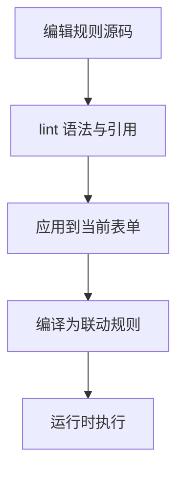
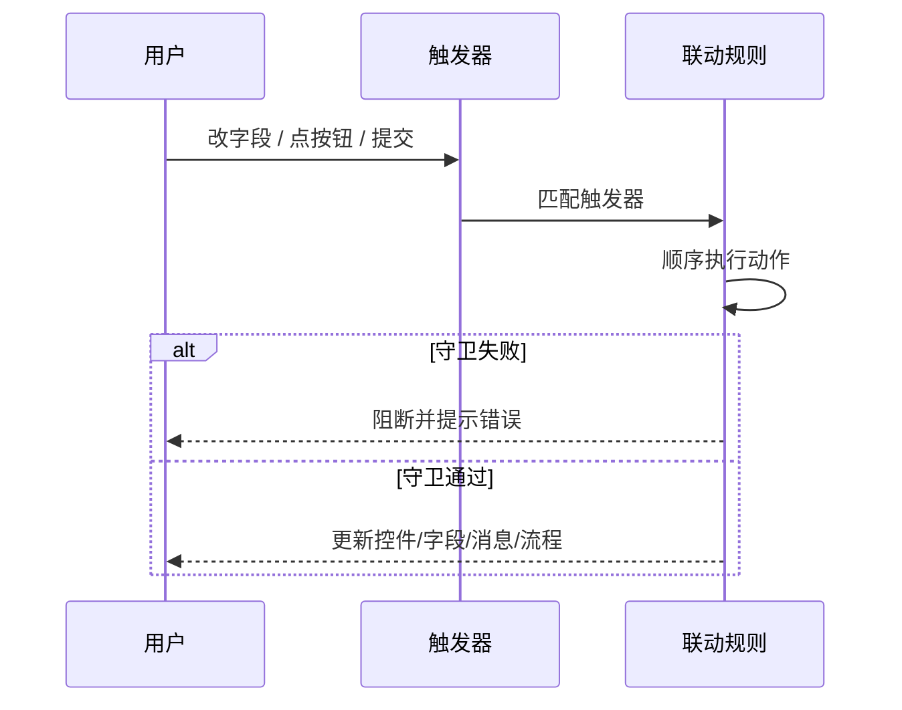
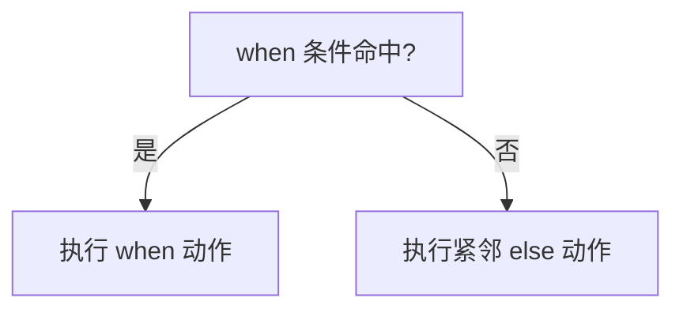
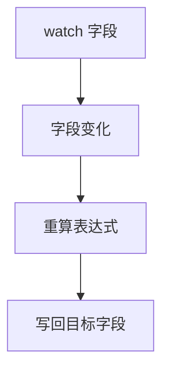

# FormFlow 规则语法 Reference

> 规则编辑器、规则语法智能体和 DSL 编译器共用本文档作为权威语义。模型建议不等于语法事实；真正的可用性由确定性 lint、引用校验和编译结果决定。

本文定义 FormFlow Behavior Rule DSL 1.0 的规范语法、执行逻辑、关键词、校验边界和典型用例。规则源码属于表单：每个表单默认有一份独立的规则代码，应用后编译为对应控件上的 `linkageRules`，不会执行任意 JavaScript，也不会访问浏览器全局对象。

## 1. 这门 DSL 用来解决什么

Behavior Rule DSL 适合处理五类轻量联动：

- 条件显隐：例如“部门是技术部时显示技术栈”
- 必填 / 可选：例如“提交前姓名和手机号必须填写”
- 计算与同步：例如“数量 × 单价 = 合计”
- 选项与流程联动：例如“省份变化后刷新城市选项”“提交时运行保存流程”
- 提交前守卫：例如“查询按钮点击前至少填写一个条件”“提交前校验邮箱、范围和长度”

如果逻辑需要长链路异步处理、复杂数据加工、外部 API 编排或大量条件分支，优先使用流程或事件脚本，不要把规则 DSL 当成通用编程语言。

## 2. 基本约定

- 一行一条规则；空行忽略。
- `#` 开始行注释；引号内的 `#` 是普通字符。
- 字段写为 `$字段`，也接受 `$form.字段`。
- 控件写为 `@控件ID`。
- 按钮守卫使用 `before click("按钮名")`。
- 字符串使用双引号或单引号；数字、`true`、`false`、`null` 直接书写。
- 一个触发器后面可以跟多个动作；多个动作用 `;` 分隔。
- DSL 不支持任意 JavaScript 语句、循环、函数定义或 `window` / `document` / `fetch`。

## 3. 完整语法

```ebnf
program          = { blank | comment | statement, newline } ;
statement        = when-rule
                 | else-rule
                 | change-rule
                 | compute-rule
                 | button-guard-rule
                 | lifecycle-rule ;

when-rule        = "when", field-ref, operator, value, "->", action-list ;
else-rule        = "else", "->", action-list ;
change-rule      = "on", "change", "(", field-ref, ")", "->", action-list ;
compute-rule     = "compute", field-ref, "=", expression, "watch", "(", field-list, ")" ;
button-guard-rule = "before", "click", "(", string, ")", "->", guard-action-list ;
lifecycle-rule   = ("on load" | "before submit" | "on submit"), "->", action-list | guard-action-list ;

action-list      = action, { ";", action } ;
guard-action-list = guard-action, { ";", guard-action } ;
action           = identifier, "(", [ argument, { ",", argument } ], ")" ;
guard-action     = identifier, "(", [ argument, { ",", argument } ], ")" ;
field-list       = field-ref, { ",", field-ref } ;
field-ref        = "$", identifier | "$form.", identifier ;
component-ref    = "@", identifier ;
comment          = "#", { any-character } ;
```

`expression` 使用 FormFlow 安全属性表达式，只能访问字段、字面量和值运算，不开放 JavaScript 全局对象。

补充说明：

- 顶层句型合法，不代表整条规则就能应用；后面还会继续做引用与参数校验。
- DSL 支持的是“规则句型”，不是通用脚本语法。
- `ebnf` 这里描述的是结构约束，真正可执行边界以下面的“语法硬约束”和“表达式约束”为准。



## 4. 关键词速查

| 关键词 | 作用 | 典型位置 |
| --- | --- | --- |
| `when` | 定义一个条件触发规则 | 行首 |
| `else` | 表示紧邻上一条 `when` 的反向分支 | 行首 |
| `on change` | 定义字段变化时的无条件动作 | 行首 |
| `compute` | 定义计算字段规则 | 行首 |
| `watch` | 声明 `compute` 依赖哪些字段 | `compute` 语句中 |
| `before click` | 给按钮点击前增加守卫校验 | 行首 |
| `on load` | 表单加载时执行 | 行首 |
| `before submit` | 提交前执行 | 行首 |
| `on submit` | 提交事件触发时执行 | 行首 |
| `->` | 把触发器与动作列表连接起来 | 触发器后 |
| `$字段` | 引用字段值 | 条件、表达式、动作参数 |
| `@控件ID` | 引用控件 | `show` / `hide` / `enable` / `disable` |

## 5. 语法硬约束

- 一行一条规则；空行忽略。
- 多个动作之间必须用 `;`，不能用逗号。
- `else` 必须紧跟上一条 `when`，中间不能插别的规则。
- `compute` 的目标必须是字段，依赖必须显式写在 `watch(...)`。
- 字段写为 `$字段` 或 `$form.字段`；控件写为 `@控件ID`。
- 按钮守卫的按钮名写在 `before click("按钮名")` 的引号里。
- 注释只支持整行 `#` 开头；不能把任意尾部片段都当注释。

## 6. 参数与表达式约束

### 6.1 参数与引用约束

- `show` / `hide` / `enable` / `disable` 期待的是控件引用，如 `@tech-stack`。
- `require` / `optional` / `clear` / `set` / `compare` 期待的是字段引用，如 `$技术栈`。
- `run("...")` 的参数是流程 ID，不是流程标题。
- `options($目标, "表ID", "筛选字段", 筛选值)` 中第二个参数是数据表 ID，不是展示名称。
- `message("内容", level)` 的 `level` 必须是系统认识的消息级别。

### 6.2 表达式约束

DSL 表达式不是 JavaScript 表达式，它只开放安全子集：

- 允许：字段引用、字符串、数字、布尔、`null`
- 允许：`+`、`-`、`*`、`/` 等基础算术
- 允许：围绕字段值做安全比较
- 不允许：函数定义、回调、`await`、`fetch`、`window`、`document`

因此下面这种写法属于越界：

```text
compute $结果 = fetch("/api") watch($关键词)
```

这类逻辑应该迁到事件脚本或流程节点里做。

## 7. 触发器介绍

### 7.1 `when`

```text
when $部门 == "技术部" -> show(@tech-stack)
```

含义：当字段值变化并满足条件时执行动作。

### 7.2 `else`

```text
when $部门 == "技术部" -> show(@tech-stack)
else -> hide(@tech-stack)
```

含义：执行紧邻上一条 `when` 的严格反向分支。

### 7.3 `on change`

```text
on change($省份) -> options($城市, "city_table", "省份", $省份)
```

含义：字段变化时直接执行动作，不判断条件。

### 7.4 `compute ... watch(...)`

```text
compute $合计 = $数量 * $单价 watch($数量, $单价)
```

含义：任一监听字段变化时，重新计算目标字段。

### 7.5 `before click`

```text
before click("lookup") -> requireAny($教师ID, $姓名)
```

含义：按钮点击前先执行守卫校验；不通过时阻断当前点击动作。

### 7.6 生命周期触发器

```text
on load -> set($状态, "草稿")
before submit -> require($姓名, $手机号)
on submit -> run("save_employee")
```

含义：

- `on load`：表单加载时执行
- `before submit`：提交前执行，适合校验和阻断
- `on submit`：提交事件发生时执行，适合跑提交流程

## 8. 条件运算符

| 运算符 | 语义 | `else` 反向 |
| --- | --- | --- |
| `==` / `!=` | 相等 / 不相等 | `!=` / `==` |
| `>` / `<=` | 大于 / 小于等于 | `<=` / `>` |
| `<` / `>=` | 小于 / 大于等于 | `>=` / `<` |
| `contains` / `not contains` | 包含 / 不包含 | 互为反向 |
| `starts with` / `not starts with` | 以文本开头 / 不以文本开头 | 互为反向 |
| `ends with` / `not ends with` | 以文本结尾 / 不以文本结尾 | 互为反向 |
| `is empty` / `is not empty` | 空 / 非空 | 互为反向 |

补充约定：

- 空值包括 `null`、`undefined`、空字符串和空数组
- 文本运算会把输入和值转换为字符串
- `contains` / `starts with` / `ends with` 更适合文本字段

## 9. 表达式介绍

表达式主要用在 `compute` 和 `set`：

```text
compute $合计 = $数量 * $单价 watch($数量, $单价)
on load -> set($摘要, $姓名 + " / " + $部门)
```

表达式支持：

- 字段引用：`$数量`
- 字面量：`"草稿"`、`1`、`true`、`null`
- 算术：`+`、`-`、`*`、`/`
- 安全比较：由属性表达式解释器处理

表达式不支持：

- 自定义函数
- 任意对象访问
- 浏览器全局对象
- 异步调用

## 10. 动作 Reference

### 10.1 常规动作

| 动作 | 作用 | 典型写法 |
| --- | --- | --- |
| `show(@控件, ...)` | 显示一个或多个控件 | `show(@tech-stack)` |
| `hide(@控件, ...)` | 隐藏一个或多个控件 | `hide(@tech-stack)` |
| `enable(@控件, ...)` | 启用一个或多个控件 | `enable(@submitBtn)` |
| `disable(@控件, ...)` | 禁用一个或多个控件 | `disable(@submitBtn)` |
| `require($字段, ...)` | 设为必填 | `require($姓名, $手机号)` |
| `optional($字段, ...)` | 取消必填 | `optional($技术栈)` |
| `clear($字段, ...)` | 清空字段值 | `clear($技术栈)` |
| `set($字段, 表达式)` | 用表达式写入字段 | `set($状态, "草稿")` |
| `message("内容", level)` | 显示消息 | `message("请检查必填项", warning)` |
| `run("流程ID")` | 运行指定流程 | `run("save_employee")` |
| `run()` | 运行当前配置流程 | `run()` |
| `options($目标, "表ID", "筛选字段", 筛选值)` | 刷新目标字段选项 | `options($城市, "city_table", "省份", $省份)` |

### 10.2 守卫动作

这些动作主要用于 `before submit` 和 `before click(...)`：

| 动作 | 作用 | 典型写法 |
| --- | --- | --- |
| `require($字段, ...)` | 提交前要求这些字段非空 | `require($姓名, $手机号)` |
| `requireAny($字段, ...)` | 至少填写一个字段 | `requireAny($教师ID, $姓名)` |
| `requireDirty($字段, ...)` | 要求字段已被修改 | `requireDirty($姓名)` |
| `keepReadonly($字段, ...)` | 要求只读字段未被改写 | `keepReadonly($审批结果)` |
| `validate($字段, email)` | 使用内置校验器 | `validate($邮箱, email)` |
| `validate($字段, pattern("..."))` | 用正则校验 | `validate($手机号, pattern("^1[3-9]\\d{9}$"))` |
| `range($字段, 最小值, 最大值)` | 校验数值范围 | `range($年龄, 18, 60)` |
| `length($字段, 最小值, 最大值)` | 校验文本长度 | `length($姓名, 2, 20)` |
| `compare($字段, ">=", $开始日期)` | 比较字段和值或其他字段 | `compare($结束日期, ">=", $开始日期)` |

## 11. 执行逻辑

### 11.1 编辑态

你在“规则代码”里写的源码先保存在表单行为文件中。编辑器会提供：

- 语法高亮
- Suggestion
- 引用补全
- 逐行诊断

### 11.2 应用态

点击“应用到当前表单”后，编译器会做三件事：

1. 解析语法
2. 校验字段、控件、流程、数据表引用
3. 编译为控件上的 `linkageRules`

只有通过错误级诊断的规则才能应用。

### 11.3 运行态

运行表单时：

- 字段变化会触发对应 `when` / `on change`
- 生命周期会触发 `on load` / `before submit` / `on submit`
- `compute` 会在监听字段变化时重算目标字段
- `before click` 会在按钮真正执行前先跑守卫动作

动作按一行内的书写顺序执行；一行多个动作之间用 `;` 分隔。



### 11.4 运行时触发顺序

不同触发器虽然都写在一份 DSL 里，但进入运行时后的切入点不同：

- 字段值变化：命中 `when` / `else` / `on change`
- 依赖字段变化：命中 `compute ... watch(...)`
- 表单初次进入运行态：命中 `on load`
- 点击某个按钮前：命中 `before click(...)`
- 提交动作发生前：命中 `before submit`
- 提交动作确认发生后：命中 `on submit`

> [!IMPORTANT]
> `before submit` 和 `on submit` 不是一回事。前者是“还有机会阻断”，后者是“提交事件已经成立，适合做收尾联动或跑流程”。

### 11.5 `else` 的判定

`else` 不是独立条件；它只是上一条 `when` 的严格反向分支。



因此下面这种写法会被认定为结构错误，而不是“另起一个反向分支”：

```text
when $部门 == "技术部" -> show(@tech-stack)
on load -> set($状态, "草稿")
else -> hide(@tech-stack)
```

### 11.6 `compute` 的触发链



`compute` 有两个容易误解的点：

- 不是目标字段变化时重算，而是 `watch(...)` 里的依赖字段变化时重算
- 不是“自动推导依赖”，依赖必须显式写出来

如果你写了：

```text
compute $合计 = $数量 * $单价 watch($数量)
```

那么只改 `$单价` 时，不会触发重算，因为 `$单价` 没有出现在 `watch(...)` 里。

### 11.7 一行内动作的执行次序

同一条规则里，动作严格按书写顺序执行：

```text
when $部门 == "技术部" -> show(@tech-stack); require($技术栈); message("请补全技术栈", info)
```

上面不是“并发三件事”，而是：

1. 先显示控件
2. 再把字段设为必填
3. 最后提示用户

如果顺序会影响结果，就必须按你想要的先后写出来。

### 11.8 诊断与阻断

规则诊断分两类：

- 错误：阻止应用
- 警告：允许应用，但会提示迁移、循环或风险

| 编号范围 | 含义 |
| --- | --- |
| `FFR000–099` | 无法编译的语法或参数错误 |
| `FFR100–199` | 兼容旧语法的迁移警告 |
| `FFR200–299` | 字段、控件、数据表或流程引用错误 |
| `FFR300–399` | 可能循环或递归的行为语义 |

### 11.9 什么时候该停在 DSL 之外

下面这些不是 DSL 的强项，文档里要直接劝退：

- 需要等待网络请求返回再继续判断
- 需要遍历长数组做复杂聚合
- 需要在多个业务对象之间维护中间状态
- 需要完整脚本能力处理异常分支

这时正确做法不是“再多堆几条规则”，而是切到流程或事件脚本。

## 12. 关键词与用例

### 12.1 条件显隐

```text
when $部门 == "技术部" -> show(@tech-stack); require($技术栈)
else -> hide(@tech-stack); clear($技术栈)
```

用途：根据部门切换技术栈输入区域。

### 12.2 计算字段

```text
compute $合计 = $数量 * $单价 watch($数量, $单价)
```

用途：数量和单价变化后自动更新合计。

### 12.3 级联选项

```text
on change($省份) -> options($城市, "city_table", "省份", $省份)
```

用途：省份变化后刷新城市选项列表。

### 12.4 加载默认值

```text
on load -> set($状态, "草稿"); set($创建方式, "手动录入")
```

用途：打开表单时初始化默认值。

### 12.5 提交前校验

```text
before submit -> require($姓名, $手机号); validate($邮箱, email); length($姓名, 2, 20)
```

用途：提交前同时做必填、邮箱和长度校验。

### 12.6 按钮查询守卫

```text
before click("lookup") -> requireAny($教师ID, $姓名)
```

用途：点击查询前，保证至少输入一个检索条件。

### 12.7 跨字段比较

```text
before submit -> compare($结束日期, ">=", $开始日期)
```

用途：确保结束日期不早于开始日期。

### 12.8 提交流程

```text
on submit -> run("save_employee"); message("提交完成", success)
```

用途：提交时触发保存流程并提示成功。

## 13. 常见错误与反例

### 13.1 把 `else` 写远了

错误：

```text
when $部门 == "技术部" -> show(@tech-stack)
on load -> set($状态, "草稿")
else -> hide(@tech-stack)
```

原因：`else` 必须紧跟上一条 `when`。

### 13.2 动作之间用逗号分隔

错误：

```text
when $部门 == "技术部" -> show(@tech-stack), require($技术栈)
```

正确：

```text
when $部门 == "技术部" -> show(@tech-stack); require($技术栈)
```

### 13.3 在 `on submit` 中再次提交

错误思路：把规则 DSL 当成表单控制器，试图在 `on submit` 里再次 `submit`。

正确做法：由表单自身发起提交；如需在提交阶段联动流程，使用 `run()`。

### 13.4 计算规则互相回写

错误思路：A 计算 B，B 又计算 A。

后果：可能出现 `FFR3xx` 循环语义警告。

### 13.5 `watch(...)` 依赖写不全

错误：

```text
compute $合计 = $数量 * $单价 watch($数量)
```

原因：这里只监听了 `$数量`，修改 `$单价` 时不会重算 `$合计`。

正确：

```text
compute $合计 = $数量 * $单价 watch($数量, $单价)
```

### 13.6 用 DSL 代替复杂脚本

错误思路：把复杂异步数据加工、API 请求、数组循环全塞进 DSL。

正确做法：DSL 只负责轻量规则；复杂逻辑交给流程或事件脚本。

## 14. 旧语法迁移

| 旧写法 | 规范写法 |
| --- | --- |
| `otherwise -> hide 技术栈` | `else -> hide(@tech-stack)` |
| `show 技术栈, require 技术栈` | `show(@tech-stack); require($技术栈)` |
| `on 省份 change -> ...` | `on change($省份) -> ...` |
| `compute 合计 = ... on change(数量)` | `compute $合计 = ... watch($数量)` |
| `set 状态 = "草稿"` | `set($状态, "草稿")` |
| `run workflow_id` | `run("workflow_id")` |
| `save` / `submit` | 由表单提交；需运行配置流程时写 `run()` |

编译器仍会读取这些旧格式并给出 `FFR1xx` 警告，便于逐步迁移；新建模板、补全和示例统一生成 1.0 规范格式。
