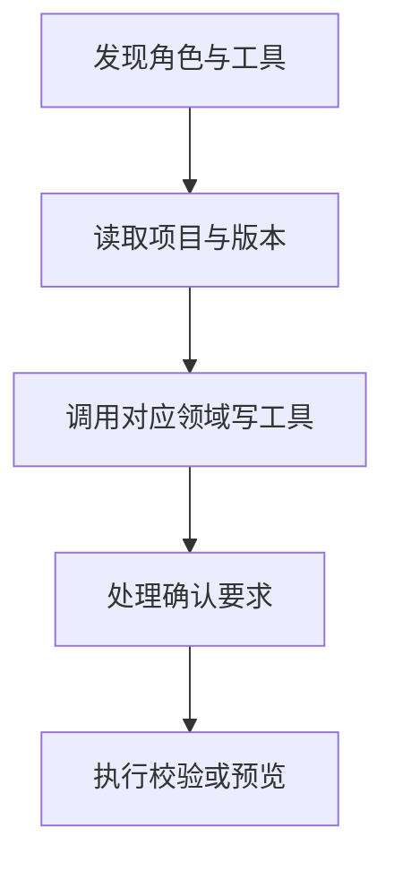

# FormFlow 大模型工具与 MCP

FormFlow Server 在同一进程中暴露七个专职 MCP。它们共用 Schema、权限、revision、确认和审计逻辑，但写工具只归属一个领域。

## 接入方式

- 查看角色：`GET /api/ai/mcp-roles`
- 查看工具：`GET /api/ai/mcp-roles/<role>/tools`
- 调用工具：`POST /api/ai/mcp-roles/<role>/tools/<tool-name>/invoke`，请求体使用 `{ "arguments": { ... } }`
- MCP Streamable HTTP：`POST /mcp/<role>`
- MCP stdio：`formflow-mcp --role <role>` 或 `FORMFLOW_MCP_ROLE=<role> formflow-mcp`

角色为 `project`、`data`、`form`、`workflow`、`behavior`、`quality`、`delivery`。不指定角色会被拒绝；原聚合 `/mcp`、`/api/ai/tools` 和无角色 invoke 接口返回 410。

云端 HTTP 使用现有 Bearer JWT，并通过 `x-tenant-id` 选择租户。stdio 在云端模式下必须设置 `FORMFLOW_TOKEN`，租户通过 `FORMFLOW_TENANT_ID` 指定。

## 写操作约定

已有项目的写操作必须携带最近一次读取返回的 `baseRevision` 和调用方生成的 `idempotencyKey`。revision 不一致时返回 `PROJECT_REVISION_CONFLICT`，调用方应重新读取项目后再生成修改。

删除、覆盖导入、发布，以及包含删除项的批量操作，第一次调用返回 `confirmation_required`。确认后使用完全相同的参数并补充 `confirmationToken` 再调用；令牌五分钟过期、绑定调用人和参数且只能使用一次。

## Skill 中的工具手册

七个领域 skill（`project/data/form/workflow/behavior/quality/delivery`）在运行时注入的「工具手册」中，为每个工具提供三部分：

- **传參**：必填/可选、类型与说明，由实时 inputSchema + 字段说明生成，随注册中心保持一致；
- **正确调用**：可直接照抄结构、替换真实 id/名称的 JSON 示例（工具定义内 `examples` + 集中式调用指导）；
- **错误调用**：常见“看起来对、实际会失败”的传参方式、原因与预期错误码（集中式 `TOOL_CALL_GUIDANCE`），禁止照抄。

系统设置 → 专家管理的「工具手册」标签页展示同一份结构化内容（`GET /api/ai/project-agent/v4/capability-bundles/:id/scopes` 的 `toolDocs` 字段），可在发布前核对每个作用域工具的调用契约。

## 数据导入

`data_source.import` 接受：

- 已通过 `/api/files/upload` 上传的 `fileId`；
- `rows` JSON 对象数组；
- `csv` 文本。

不接受服务器文件路径或远程 URL。内联数据最多 5 MB、10,000 行；查询每页最多 500 行；单次批量写回最多 1,000 个变更。

## 项目编排智能体

项目智能体 V4 使用显式版本 API（旧 V2/V1 端点已移除）：

- `GET/POST /api/ai/project-agent/v4/threads`
- `GET /api/ai/project-agent/v4/threads/history?q=&status=&projectId=&archived=&cursor=&limit=`：轻量历史摘要 + 不透明游标分页。
- `GET/PATCH /api/ai/project-agent/v4/threads/:id`：线程详情与标题/置顶更新。
- `PUT /api/ai/project-agent/v4/threads/:id/projects`：限定项目范围。
- `DELETE /api/ai/project-agent/v4/threads/:id`、`POST .../restore`：归档与恢复。
- `DELETE /api/ai/project-agent/v4/threads/:id/permanent`：确认后永久删除。
- `POST /api/ai/project-agent/v4/threads/:id/turns`、`.../turns/retry`
- `POST /api/ai/project-agent/v4/threads/:id/plan/confirm`、`.../plan/reject`：确认或拒绝目标契约（拒绝携带反馈重新规划）。
- `POST /api/ai/project-agent/v4/threads/:id/operations/:operationId/decision`
- `POST /api/ai/project-agent/v4/threads/:id/control`（pause/continue/stop/retry/replan）、`.../steer`
- `GET /api/ai/project-agent/v4/threads/:id/events?afterSeq=<seq>`
- `GET/POST /api/ai/project-agent/v4/capability-bundles`、`GET .../:id/scopes`

智能体采用单一主循环：一个智能体持有线程上下文与单一活跃计划（goal、successCriteria、任务清单），每次迭代决定下一步调用哪个 MCP 角色作用域的工具；写工具前自动刷新最新 revision 并注入稳定 `idempotencyKey`，删除/覆盖操作独立等待确认，`release.apply` 永远不可调用。七个领域以 skill 形式组织（`project/data/form/workflow/behavior/quality/delivery`），决策时先按 skill 目录选择作用域，再使用该领域工具。确定性门禁不因目标确认放宽：写任务通过前必须 `project.validate`，线程完成必须通过结构校验与计划包含的质量/交付预检。连续两步无证据推进暂停提问，同一阻塞条件连续三次标记 blocked，决策步预算超限暂停。

事件接口支持 JSON 补播与 `text/event-stream`，所有事件携带线程内单调 `seq`，客户端断线后从最后序号恢复。主要事件：`turn_started`、`grounding_completed`、`plan_proposed`、`plan_confirmed`、`plan_rejected`、`tool_call`、`tool_observation`、`revision_refreshed`、`approval_required`、`approval_decided`、`task_started/task_completed/task_failed`、`gate_failed`、`thread_completed`、`thread_blocked`、`question_asked`。能力包内的 agents 已降级为作用域配置（提示词片段 + 工具白名单 + 附加知识），系统 skill 提供领域规范与运行时工具目录。

项目质量与测试相关工具：

- `project.quality.inspect`：统一阶段门禁、引用、绑定、主键和最近回归结果。
- `mock_data.profile/generate/preview/apply`：固定 seed 生成；正常行只追加，负向场景隔离保存。
- `project_test.generate/run/history`：持久化测试套件、运行结构/规则/表单约束测试并保留最近二十次结果。
- `rule_code.update`：由 behavior MCP 专职写入 Behavior Rule DSL；写入前强制 lint，然后编译为表单控件联动。`form.update` 不能绕过该边界修改规则或行为。
- `rule_verify.model`：对表单规则运行有界显式状态模型检查（终止性 + 确定性抽查），返回 `passed/acyclic/deterministic/statesExplored/counterexample/staticDiagnostics`；静态错误、疑似无限触发链或确定性不一致均判为未通过。智能体写任务完成与线程最终门禁会自动对携带规则的表单运行它。

项目包中的 `testing/testing.json` 保存生成配置、隔离夹具、测试套件和有界运行历史；旧包缺少该文件时按空资产读取。

## 表单模板

- `catalog.form_templates.list`：列出表单模板（空白、基础录入、查询修改、主从详情），返回 `key/label/description/formMode/scaffoldFromTable/requiresRelation/options`。
- `catalog.form_templates.get {key}`：读取单个模板详情；未知 key 返回错误。
- `form.create` 支持可选 `templateId`：不传 `design` 时按模板初始化空骨架（记录 `templateKey` 与默认 `formMode`）；同时传 `design` 时仅补齐缺失的 `templateKey`。
- `form.generate_from_table` 支持可选 `templateId`：未显式传 `mode` 时采用模板默认模式，生成的设计记录 `templateKey`。
- 主从详情模板（`master-detail`）要求先声明主从关系；其余模板可直接从数据表生成。

## 表单坐标约定

新建或更新的表单设计使用 `coordinateSpace: "window-content-v1"`。控件 `x/y` 是窗体内容区局部坐标；内容区位于固定 `52px` 标题栏和窗体内边距之后。窗体底栏启用时预留 `64px`。编辑、预览和使用态共用这一坐标模型，窗体按控件边界只增不减地自动扩展；使用态保持原始像素尺寸，外层最多占 `90vw/90vh`，超出部分滚动而不缩放或重排。

未带 `coordinateSpace` 的旧表单在读取时按旧画布绝对坐标迁移。迁移会保持控件原画布位置、处理左侧或顶部负坐标并扩展窗体，保存标记后不会重复换算。

## MCP resources

- `formflow://roles/{role}/capabilities`（所有角色）
- `formflow://catalog/components`
- `formflow://catalog/workflow-nodes`
- `formflow://catalog/events`
- `formflow://projects`
- `formflow://projects/{projectId}/validation`

资源只在相关角色中出现。完整工具名称、负责人、说明及输入 Schema 始终以该角色的 `tools/list` 或 `/api/ai/mcp-roles/<role>/tools` 为准。`project.apply_patch` 已移除；创建后的编辑必须使用相应领域工具。发布草稿使用 `delivery` 角色的 `release.update`。
