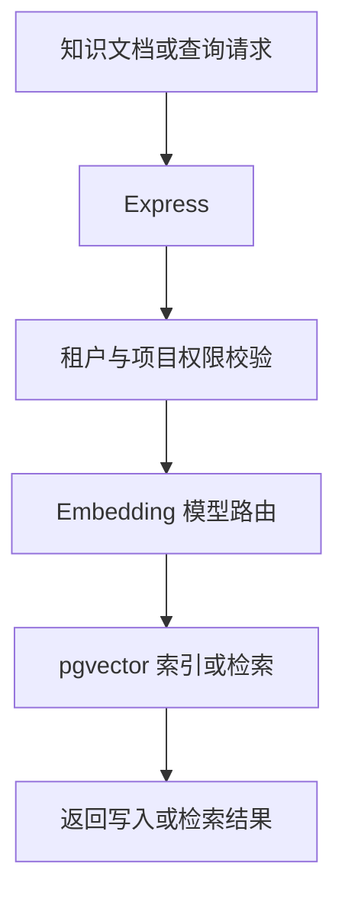
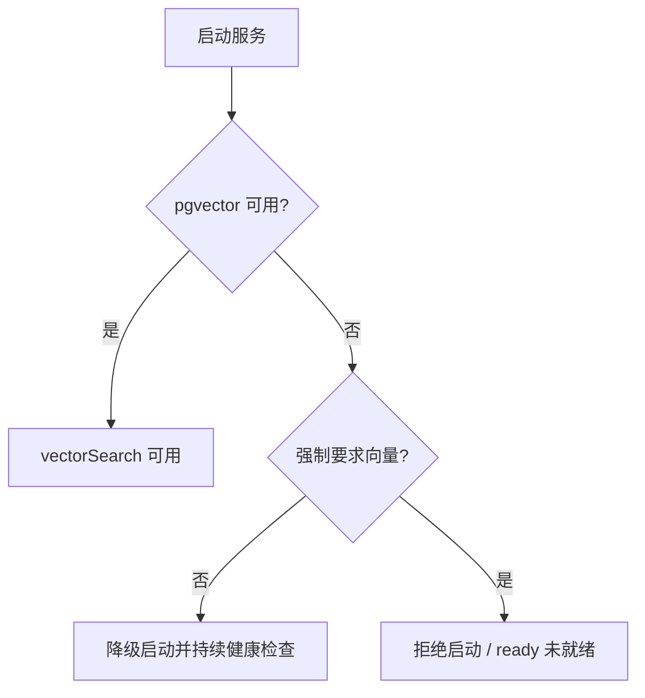

# pgvector 向量检索

FormFlow 使用 PostgreSQL 的 `pgvector` 扩展保存知识分块和 Embedding。Express 负责租户、项目权限、Embedding 模型路由和向量数据访问；浏览器不直接访问数据库。



## 启动与健康检查

Docker Compose 使用 `pgvector/pgvector:pg17`。后端启动时会执行 `CREATE EXTENSION IF NOT EXISTS vector`，创建 `formflow_knowledge_chunks`，随后在 `/api/health` 中暴露：

```json
{
  "status": "ok",
  "ready": true,
  "capabilities": { "vectorSearch": true },
  "checks": { "database": { "status": "ok" }, "ai": { "status": "ok" }, "vector": { "status": "ok" } }
}
```

`status` 在数据库或强制向量不可用时为 `not_ready`，数据库正常但 AI 不可用时为 `degraded`；`ready` 只由数据库状态（以及 `FORMFLOW_VECTOR_REQUIRED=true` 时的向量状态）决定。

本地 PostgreSQL 没有安装扩展时，默认以降级模式启动，`vectorSearch` 为 `false`，后台健康检查会继续尝试恢复。设置 `FORMFLOW_VECTOR_REQUIRED=true` 可令生产环境在扩展不可用时拒绝启动，并在运行期间将 `/api/ready` 标记为未就绪。



向量列不固定维度，记录会保存实际 `dimensions` 和 `embedding_model`。需要 HNSW 索引时设置：

```dotenv
FORMFLOW_VECTOR_INDEX_DIMENSIONS=1024,1536
```

只应填写当前 Embedding 模型真实使用且不超过 2000 的维度；未配置的维度仍可进行精确检索。

## API

写入知识分块并自动生成 Embedding：

```http
POST /api/ai/knowledge/index
Content-Type: application/json

{
  "profileId": "embedding-profile",
  "projectId": "project-a",
  "collection": "behavior-reference",
  "documents": [
    {
      "sourceId": "rule-syntax",
      "sourceType": "documentation",
      "chunkIndex": 0,
      "content": "when 条件 -> 动作",
      "metadata": { "version": "1" }
    }
  ]
}
```

相似度检索：

```http
POST /api/ai/knowledge/search
Content-Type: application/json

{
  "profileId": "embedding-profile",
  "projectId": "project-a",
  "collection": "behavior-reference",
  "query": "字段变化时如何显示控件",
  "limit": 8,
  "sourceTypes": ["documentation"],
  "metadata": { "version": "1" }
}
```

删除一个来源或整个集合：

```http
DELETE /api/ai/knowledge
Content-Type: application/json

{
  "projectId": "project-a",
  "collection": "behavior-reference",
  "sourceId": "rule-syntax"
}
```

所有操作都强制使用当前请求的 `tenantId` 和 `projectId`，检索结果不会跨租户或跨项目返回。索引和检索必须使用同一个模型 Profile；切换 Embedding 模型后应以新模型重新生成向量。
