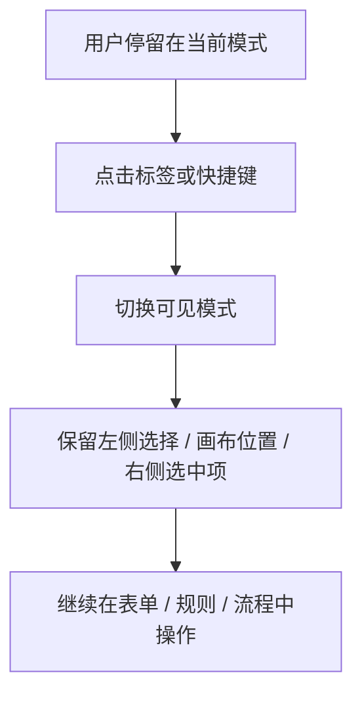

# 编辑器模式切换优化方案

> 状态：设计稿，待确认
> 日期：2026-07-30

## 问题

用户在「表单设计」「行为定义」「流程设计」之间切换时存在四个痛点：
1. **切换太慢** — 点击标签后整个页面重排，视觉跳动大
2. **上下文丢失** — 切换后忘记之前选中的控件/字段
3. **找不到入口** — 不理解「行为定义」和「流程编排」的概念
4. **操作步骤多** — 想看表单预览需要点两次以上

目标用户：混合群体（技术人员搭框架，业务人员填表单）

## 方案

### 1. 命名简化

| 当前 | 建议 |
|------|------|
| 数据预览 | 数据 |
| 表单设计 | 表单 |
| 行为定义 | 规则 |
| 流程编排 | 流程 |
| 测试运行 | 测试 |
| 项目设置 | 设置 |

理由：标签栏空间有限，越简洁越好。「规则」比「行为定义」更直观，非技术人员能理解。

### 2. 快捷键

| 快捷键 | 功能 |
|--------|------|
| `Cmd/Ctrl+1` | 表单 |
| `Cmd/Ctrl+2` | 规则 |
| `Cmd/Ctrl+3` | 流程 |
| `Cmd/Ctrl+,` | 设置 |

只给最常用的三个模式设快捷键，其他模式通过标签栏切换。

### 3. 上下文保留

切换模式时保留以下状态：
- 左侧面板的选中标签（控件/字段/表单/规则）
- 画布的滚动位置和缩放比例
- 右侧属性面板的选中项

实现方式：使用 `useRef` 保存各面板状态，切换模式时不重新挂载组件，只切换可见性。

### 4. 字段引用面板

#### 规则界面
左侧面板增加「字段引用」区域，展示：
- 字段名
- 字段类型（文本/数字/日期/下拉等）
- 绑定控件（输入框/下拉框/日期选择器等）

用户在写规则时可以直接看到字段信息，不需要切回表单设计。

#### 流程界面
- 左侧面板增加「字段引用」区域（同规则界面）
- 流程节点配置面板增加字段下拉选择器，选择时显示字段名 + 类型 + 绑定控件

### 5. 关联式导航

表单设计左侧面板增加「规则」标签，显示当前表单关联的规则列表。
- 点击规则项 → 切换到规则模式并定位到该规则
- 空状态显示「暂无规则，点击创建」

### 6. 学习成本降低

#### 命名业务化
已通过方案 1 解决。

#### 关联式导航
已通过方案 5 解决。

#### 首次引导
- 规则列表为空时，显示空状态引导页面，包含「什么是规则？」的简短说明 + 「创建第一个规则」按钮
- 规则编辑器预填一个示例规则（比如「当金额 > 100 时，显示审批按钮」）
- 后续可扩展：规则编辑器自动补全（输入字段名时弹出字段列表）

## 优先级

### P0 — 核心体验（必须做）
1. 命名简化：数据 / 表单 / 规则 / 流程 / 测试 / 设置
2. 上下文保留：切换模式时保留所有面板状态
3. 规则界面左侧面板加「字段引用」区域
4. 表单设计左侧面板加「规则」标签

### P1 — 效率提升（应该做）
5. 快捷键：Cmd/Ctrl+1/2/3 切换表单/规则/流程
6. 流程界面左侧面板加「字段引用」区域
7. 流程节点配置面板加字段下拉选择器

### P2 — 学习成本（可以做）
8. 规则列表空状态引导 + 预填示例规则
9. 规则编辑器自动补全

## 涉及文件

- `ui/src/pages/editor/ProjectWorkspaceTabs.tsx` — 命名修改
- `ui/src/pages/editor/UnifiedEditorPage.tsx` — 上下文保留、字段引用面板、关联导航
- `ui/src/components/BehaviorDslEditor.tsx` — 字段引用面板集成
- `ui/src/pages/editor/CanvasPage.tsx` — 流程界面字段引用
- `ui/src/style/designer-unified.css` — 新增样式
- `ui/src/style/variables.css` — 可能需要新增 CSS 变量
