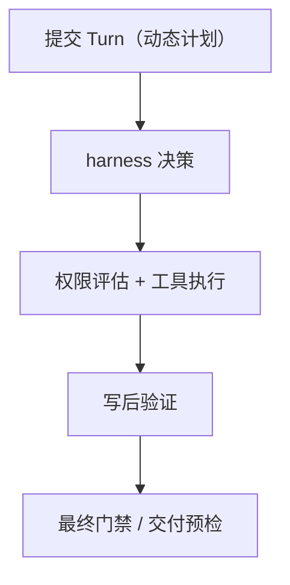

# 智能体项目创建与编辑

## 项目智能体（V5 harness 单循环）

在线智能体采用 **Codex 式 harness 架构**，端点挂载于 `/api/ai/project-agent/v5`（旧 V4/V2/V1 端点与 v1 记录已彻底移除/忽略）：

- `POST /threads` 建立线程，`POST /threads/:id/turns` 提交即动态执行（无确认环节），`POST /threads/:id/operations/:operationId/decision` 处理破坏性操作确认，`POST /threads/:id/control` 与 `/steer` 控制暂停/继续/停止/转向，`GET /threads/:id/events` 以 SSE 或 JSON 读取带单调 `seq` 的事件流。
- Agent Core 按 harness 组件拆分（`server/src/agent-core/harness/`）：领域无关的 `agent-loop` 驱动负责 Turn 状态机、终止语义与验证闭环编排；PromptAssembler、ToolExecutor、PermissionEvaluator、VerificationEngine、RecoveryManager、ContextManager、EventEmitter 各司其职；FormFlow 的 MCP 工具、门禁与 skill 通过 `formflow-harness.ts` 作为适配器注入，模型可替换、所有副作用必须走工具。
- 线程持有**动态展示型计划**（goal、successCriteria、summary、steps，仅展示、不约束执行、无需确认），模型可用 harness 工具 `plan.update` 随时修订。
- 七个领域以 skill 形式组织（项目/数据/表单/流程/行为/质量/交付），决策时按目标关键词与最近活动动态注入 Top 2 领域 skill + 通用循环 skill；能力包中的 agents 降级为作用域配置（指令 + 工具白名单 + 知识）。
- 确定性门禁：写成功后自动最小验证（`project.validate`，行为/规则追加 `rule_verify.model`）；Turn 完成必须通过结构校验、形式化验证、回归测试与质量/交付预检（`release.preview`）；`release.apply` 永远不可调用。
- 终止语义：连续无进展自动纠正后继续，同类问题收敛到阈值才标记 blocked 提问；决策步预算超限暂停。
- 可靠性：一步决策可批量并行最多 3 个只读工具（`batchReads`）；瞬时错误与 revision 冲突自动恢复（消耗 `maxRecoveryCycles`）；大工具结果转存 artifact 并可用 `context.read_artifact` 分段回读；超长提示词触发结构化上下文压缩；写操作前自动建检查点，暂停/受阻后可一键恢复到最近检查点；Turn 完成前必须运行回归测试（预存失败不阻塞、引入失败必须修复）并通过模型自审；每 turn 记录运行指标（模型调用/工具/无效比/重试/压缩/暂停），线程页状态栏与管理员 `/metrics` 可见。

## 七领域 MCP

在线项目创建与编辑由七个专职 MCP 提供：

- `project`
- `data`
- `form`
- `workflow`
- `behavior`
- `quality`
- `delivery`

HTTP 使用 `/mcp/<role>`，stdio 使用 `formflow-mcp --role <role>`。原无角色聚合入口已移除。完整接口说明见 [`../llm-tools-mcp.md`](../llm-tools-mcp.md)。

仓库级调用约束、revision、幂等、确认与发布门禁，统一以根目录 [`../../CODEX.md`](../../CODEX.md) 为准。



## Codex 内置 skill

仓库内置了面向 Codex 的 FormFlow v2 skill：[`../../.codex/skills/formflow-project-editor/`](../../.codex/skills/formflow-project-editor/)。

它把“紧凑 YAML 意图”转换成规范化的 `.formflow` 目录和 ZIP，适合用于：

- 创建新项目
- 编辑现有项目
- 校验引用关系
- 确定性打包与解包

核心能力：

- `inspect`：读取目录或 ZIP，输出项目摘要、数据表、表单、行为、流程和引用关系
- `create`：根据 YAML 创建规范化 FormFlow v2 项目，并可同时输出 ZIP
- `normalize`：把现有项目映射到冻结的 v2 结构后，再按稳定 ID 应用增删改
- `validate`：检查 schema、ID、索引、引用、数据 key、流程端口和交付门禁
- `pack` / `unpack`：确定性打包和解包

常用命令：

```bash
node .codex/skills/formflow-project-editor/scripts/formflow-project.mjs \
  create ./project-spec.yaml \
  --out ./my-project.formflow

node .codex/skills/formflow-project-editor/scripts/formflow-project.mjs \
  validate ./my-project.formflow \
  --json

node .codex/skills/formflow-project-editor/scripts/formflow-project.mjs \
  inspect ./my-project.formflow
```

相关格式与规范：

- [`../../.codex/skills/formflow-project-editor/references/authoring-spec.md`](../../.codex/skills/formflow-project-editor/references/authoring-spec.md)
- [`../../.codex/skills/formflow-project-editor/references/v2-format.md`](../../.codex/skills/formflow-project-editor/references/v2-format.md)
- [`../../.codex/skills/formflow-project-editor/references/validation.md`](../../.codex/skills/formflow-project-editor/references/validation.md)

## 内置模板与示例项目

项目向导与 MCP `project.initialize` 共用四套可运行行业模板：

| 模板 ID | 名称 | 主路径 |
|---|---|---|
| `game_analytics` | 游戏数据分析 | 玩家、事件、付费与活动录入分析 |
| `flexible_employment` | 灵活就业分析 | 从业、工时、结算与保障分析 |
| `china_population_forecast` | 中国人口预测 | 历史口径与多情景预测 |
| `check_valve_selection` | 止回阀选型 | 工况录入、规则选型与结果看板 |

旧模板 ID `blank_form`、`data_entry`、`query_edit`、`approval_flow`、`data_dashboard` 会兼容映射到上述行业模板。

仓库携带四个官方行业演示项目包（目录与 ZIP 均入库）：连锁零售门店销售与库存管理、门诊预约与随访管理、培训机构学员报名与考勤管理、工程项目合同与进度管理，位于 `projects/data/`，可作为模板参考导入。其余会话生成的临时项目（如 `proj_*`）保持忽略、不提交。设备巡检负向回归基线不再以包文件存放，改为 `server/src/services/equipment-inspection-agent-regression.test.ts` 内联的合成坏包，仅用于质量诊断回归。
