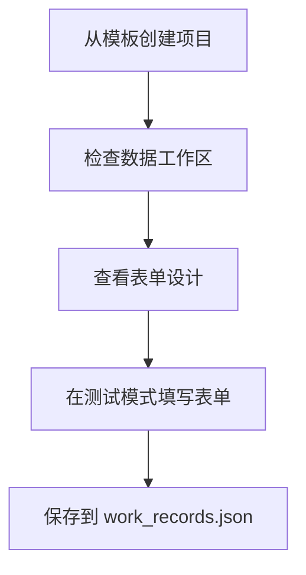
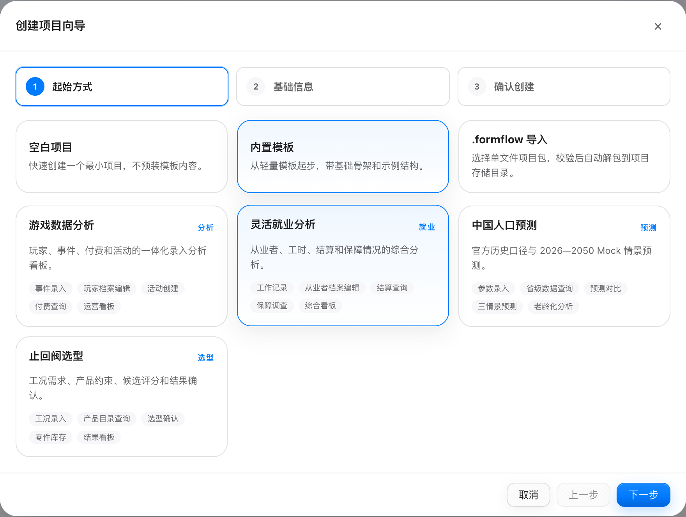
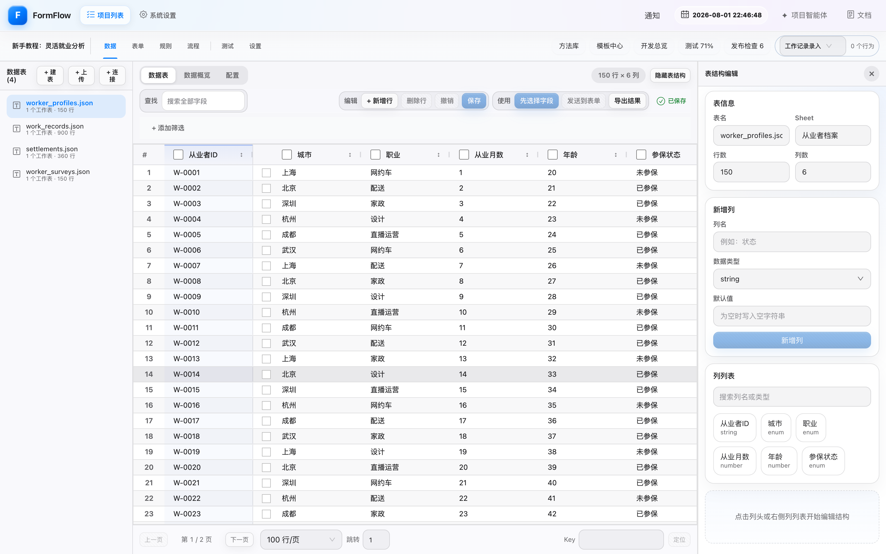
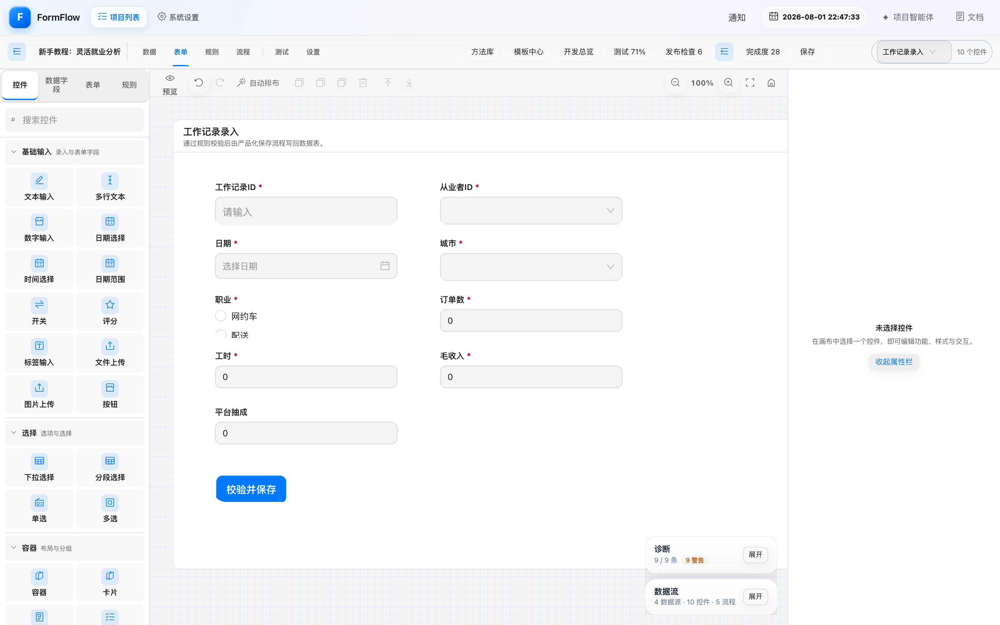
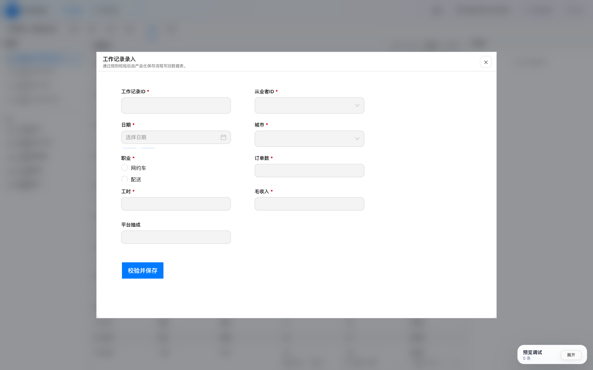
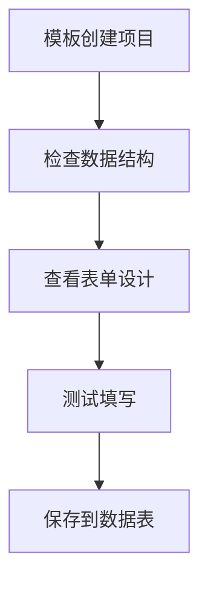

# 新手教程：10 分钟完成第一个 FormFlow 应用

这篇教程不要求准备 Excel，也不要求编写代码。你会从内置的“灵活就业分析”模板开始，依次认识数据、表单设计和测试运行，最后打开一个可以填写并保存的表单。

完成后，你将得到一个包含 **4 张数据表、5 个表单和配套流程** 的独立项目。教程中的操作只会修改新建项目，不会影响模板或其他项目。

## 开始前

1. 按照[安装与启动](./getting-started.md#安装与启动)运行 `pnpm dev:all`。
2. 在浏览器打开 `http://localhost:5173`。
3. 确认页面顶部显示 FormFlow，且项目列表可以正常加载。

> 截图使用 1600 × 1000 视口和 2× 像素密度制作。界面尺寸不同不会影响按钮名称和操作顺序。

## 第一步：从模板创建项目

1. 在“所有项目”页点击“新建项目”。
2. 选择“内置模板”。
3. 选择“灵活就业分析”，点击“下一步”。
4. 把项目名称改为“新手教程：灵活就业分析”，再次点击“下一步”。
5. 核对摘要后点击“创建并进入项目”。

_蓝色边框表示当前选中的起始方式和模板。内置模板自带演示数据，适合第一次熟悉完整操作路径。_

创建成功后，页面会自动进入项目工作区的“数据”页。如果停留在项目列表，找到刚创建的项目并点击“打开”即可。

## 第二步：认识数据工作区

左侧“数据表”区域列出了模板自带的 4 张表。先选中 `worker_profiles.json`，然后观察中间的数据表格和右侧的表结构：

- 左侧用于切换数据表，也可以通过“+ 上传”导入自己的 Excel、CSV 或 JSON。
- 中间用于查找、筛选、新增、编辑和导出数据。
- 右侧显示表名、Sheet、字段类型等结构信息；不需要修改也可以继续。
- 顶部的“数据 / 表单 / 规则 / 流程 / 测试 / 设置”是项目的主要工作区入口。

_当前数据表包含从业者 ID、城市、职业、从业月数、年龄和参保状态。状态栏显示“已保存”时，说明没有待提交的数据改动。_

可以试着在“查找”中输入“上海”，再清空搜索。第一次体验时不要删除数据表；删除操作可能影响已经绑定的表单和流程。

## 第三步：查看表单设计

点击顶部“表单”。模板会打开“工作记录录入”表单。第一次进入时会出现 6 步界面引导，可以跟随引导，也可以点击“跳过引导”后对照下面的说明：

- 左侧工具箱提供输入、选择、容器等控件。
- 中间画布展示最终表单布局。
- 右侧属性栏用于修改当前选中控件的字段绑定、校验和样式。
- 右上角的表单下拉框可以切换模板中的其他表单。

_这个表单已经绑定工作记录数据表，并包含必填项、下拉选项、数值输入和“校验并保存”按钮。_

先不要修改控件。确认画布上能看到“工作记录 ID”“从业者 ID”“日期”“城市”等字段，就说明模板内容已经正确加载。

## 第四步：在测试模式运行表单

1. 点击顶部“测试”。
2. 在左侧“表单”列表点击“工作记录录入”。
3. 在弹出的运行窗口中填写带红色星号的字段。
4. 点击“校验并保存”。

_测试模式使用真实的表单控件和校验规则。带红色星号的字段必须填写，提交失败时先按页面提示补齐内容。_

推荐使用一组容易识别的测试值，例如：

| 字段 | 示例值 |
|---|---|
| 工作记录 ID | `TUTORIAL-001` |
| 从业者 ID | 从下拉列表任选一项 |
| 日期 | 今天 |
| 城市 | 从下拉列表任选一项 |
| 职业 | 网约车 |
| 订单数 | `3` |
| 工时 | `2` |
| 毛收入 | `120` |
| 平台抽成 | `12` |

保存成功后，关闭运行窗口，点击顶部“数据”，选择左侧 `work_records.json` 数据表，再在“查找”框中输入 `TUTORIAL-001`。能够找到这一行，说明表单、校验和数据写回已经完成闭环。

## 你已经完成了什么

现在你已经走通 FormFlow 最重要的工作流：

接下来可以按你的目标继续：

- 想导入自己的数据：返回[快速开始与常见问题](./getting-started.md#第二步导入自己的数据)。
- 想修改控件和校验：阅读[功能概览中的表单设计器](./overview.md#表单设计器)。
- 想添加字段联动：阅读[规则语法参考](../behavior-rule-syntax.md)。
- 想用智能体或 MCP 编辑项目：阅读[智能体项目创建与编辑](./ai-project-editing.md)。

## 遇到问题时

### 创建按钮不可用

选择“内置模板”后还必须再选择一张具体模板卡片。选中项会显示蓝色边框，然后“下一步”才可用。

### 页面没有模板中的数据或表单

先返回项目列表，删除本次未完成的教程项目，再重新从“灵活就业分析”模板创建。不要选择“空白项目”。

### 保存后找不到测试记录

确认运行窗口提示保存成功，并在 `work_records.json` 中搜索工作记录 ID，而不是在默认打开的 `worker_profiles.json` 中搜索。

### 想从 Excel 开始而不是使用模板

创建“空白项目”，进入“数据”页后点击“+ 上传”，选择 Excel / CSV / JSON 文件。导入完成后勾选字段并使用“发送到表单”或模板生成入口。更简短的操作清单见[使用自己的数据快速上手](./getting-started.md#使用自己的数据快速上手)。
