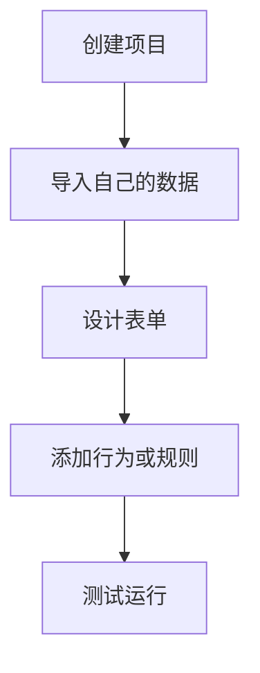

# 快速开始与常见问题

## 安装与启动

macOS / Linux：

```bash
# 统一初始化 Node、pnpm、Python venv 和依赖
bash scripts/init-env.sh

# 启动开发服务器（前端 + 后端）
pnpm dev:all

# 或分别启动
pnpm dev
pnpm server

# 完整校验
pnpm verify

# 构建 / 类型检查 / 测试
pnpm build
pnpm typecheck
pnpm test
pnpm test:e2e
```

Windows PowerShell：

```powershell
powershell -ExecutionPolicy Bypass -File scripts/init-env.ps1
pnpm dev:all
```

说明：

- 初始化脚本会输出详细阶段日志，并自动创建或复用仓库根目录下的 `venv/`
- 如果缺少 Node.js 或 Python，脚本不会自动安装，只会给出可用版本与下载指引
- `pnpm verify` 是提交前统一门禁

## 第一次使用

如果你还没有自己的数据，推荐先完成带 4 张高清界面截图的[新手教程：10 分钟完成第一个 FormFlow 应用](./beginner-tutorial.md)。它从内置模板开始，不需要准备 Excel 或编写代码，并会带你走通数据、表单设计、测试和保存的完整闭环。

如果你已经准备好 Excel、CSV、TSV、JSON、XML 或 Parquet，可以直接按下面的清单开始。



## 使用自己的数据快速上手

### 第一步：创建项目

1. 启动开发服务器：`pnpm dev:all`
2. 打开浏览器访问 `http://localhost:5173`
3. 点击首页“新建项目”，输入项目名称和描述

### 第二步：导入自己的数据

1. 进入项目后切换到“数据”
2. 点击“+ 上传”，选择 Excel / CSV / TSV / JSON / XML / Parquet 文件
3. 系统自动解析表结构、列类型和数据样本

### 第三步：设计表单

1. 切换到“表单设计”
2. 从左侧工具箱拖拽控件到画布
3. 在右侧属性面板配置字段名、校验规则和样式

### 第四步：添加行为

1. 切换到“行为定义”
2. 复杂逻辑可新建事件脚本，例如：

```javascript
if (field === '部门') {
  await setVisible('技术栈', value === '技术部');
}
```

3. 简单联动可使用规则代码，例如：

```text
when $部门 == "技术部" -> show(@tech-stack); require($技术栈)
else -> hide(@tech-stack); clear($技术栈)
```

### 第五步：测试运行

1. 切换到“测试运行”
2. 预览表单效果并测试行为逻辑
3. 查看脚本日志和数据变化

## 典型使用场景

### 员工信息录入

- 数据表：员工信息表（工号、姓名、部门、职位、薪资）
- 表单：文本输入、数字输入、下拉选择
- 行为：自动生成工号、部门联动、提交前校验
- 流程：查询员工、新增员工、更新员工

### 服务工单管理

- 数据表：服务工单表（工单号、客户、问题类型、状态、处理人）
- 表单：工单录入、工单查询、工单处理
- 行为：状态流转、自动分配、超时提醒
- 流程：创建工单、查询工单、更新工单

### 数据统计分析

- 数据表：销售数据表（日期、产品、数量、金额）
- 表单：数据录入、统计查询、图表展示
- 行为：数据校验、自动计算、图表更新
- 流程：数据导入、统计分析、导出报表

## 常见问题

### Q: 如何实现字段联动？

简单联动优先使用规则代码，例如 `when $部门 == "技术部" -> show(@tech-stack)`。完整语法见 [`../behavior-rule-syntax.md`](../behavior-rule-syntax.md)。复杂逻辑可创建 `onFieldChange` 脚本：

```javascript
if (field === '部门') {
  await setVisible('技术栈', value === '技术部');
}
```

### Q: 如何在提交前校验数据？

使用 `onSubmit` 或 `onBeforeSubmit`。推荐调用 `requireFields`：

```javascript
const check = await ctx.requireFields(['姓名', '手机号']);
if (!check.valid) {
  showMessage('请填写必填项', 'error');
  return;
}
```

### Q: 如何实现级联选择？

```javascript
const cityOptions = {
  '广东': ['广州', '深圳'],
  '浙江': ['杭州', '宁波']
};
const options = cityOptions[value] || [];
await setValue('城市', options[0] || '');
```

### Q: 如何调用流程？

在按钮的 `onClick` 事件中使用 `runConfiguredWorkflow()`。流程需先在“流程编排”页设计完成并绑定到事件。

### Q: 如何导出数据？

可使用流程中的“数据导出”节点，或在使用模式中直接导出当前数据。
