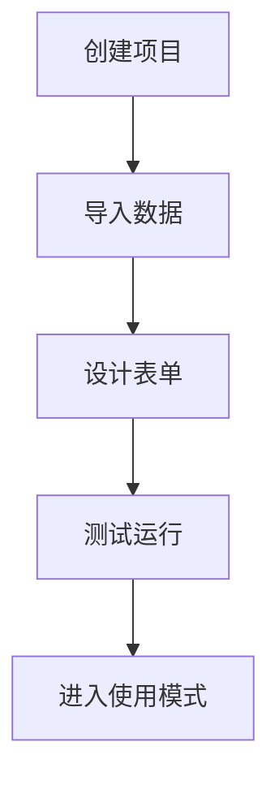
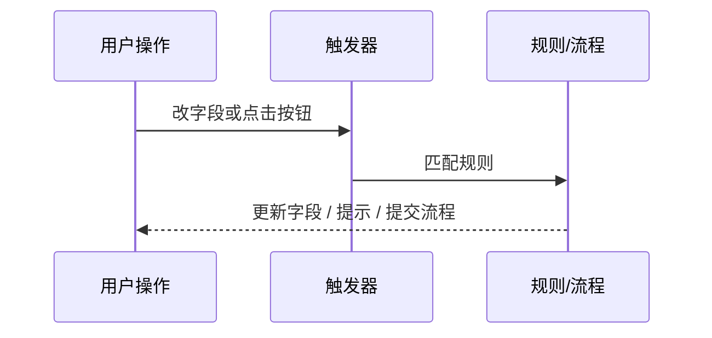

# FormFlow 文档 Mermaid 流程图规范

这份规范用于统一仓库 Markdown 和前端文档中的流程图样式。

## 何时使用

- 讲“步骤推进”时，用流程图
- 讲“触发顺序 / 状态变化”时，用流程图或时序图
- 讲“门禁 / 分支判断”时，用纵向流程图
- 纯字段表、参数表、枚举表，不强行配图

## 图种约定

- 文档页默认主链：`flowchart TD`
- 只有节点很短、横向更清楚时才使用 `flowchart LR`
- 阶段 / 门禁 / 生命周期：`flowchart TD`
- 运行时交互：`sequenceDiagram`

## 文案约定

- 节点标签写业务动作，不写空泛标题
- 使用引号包裹中文标签，例如 `A["创建项目"]`
- 一张图只讲一条主线；补充说明放图外
- 同页同概念用同一叫法，例如统一写“应用到当前表单”

## 规模约定

- 单图优先 4–7 个节点
- 超过 7 个节点时，拆成两张图
- 避免极长横向链路和大段节点文字

## 样式禁忌

- 不用 emoji
- 不用口号式节点文案
- 不在节点里堆实现细节
- 不用颜色语义替代正文说明

## 推荐示例

