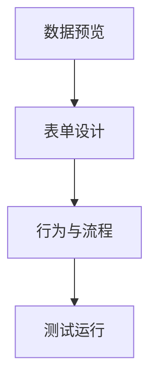

# FormFlow Studio 概览

## 功能概览

### 数据预览

- 上传 Excel（xlsx/xls）、CSV、TSV、JSON、XML、Parquet，自动识别表头、字段类型、数据概览
- 支持外部数据源直连（MySQL / PostgreSQL / API），连接配置加密存储
- AG Grid 支持服务端分页、排序、筛选、全文搜索、Key 定位与完整结果导出
- 字段类型推断（`string` / `number` / `date` / `boolean` / `enum`）
- 稳定 `rowKey` 跨页追踪新增、修改和删除，批量保存时校验数据版本、字段类型与主键唯一性
- 支持“发送到表单”和“生成表单”两条下游链路

### 流程编排

- 拖拽式节点画布，支持多选、右键菜单、快捷键、拼音搜索、收藏与最近使用
- 已注册 **234 个节点包**（含 7 个流程节点分组文档共 241 个可检索条目），接入统一执行与发现体系
- 提供 **11 个版本化高阶宏节点** 与 **5 个流程配方**
- 25 种端口类型与类型校验器
- 支持 `onNodeFailure`、`timeoutMs`、`nodeTimeoutMs`、`parallel`、`isolatedScopes`、`debug`、`transactionalSideEffects`

### Range Selector（Excel 级选区）

- 拖拽选区、方向键导航、Shift 扩展、Ctrl 多区域
- 行列整选、拖拽角手柄、右键菜单、列宽调整与双击自适应
- Name Box 地址跳转、Formula Bar 内容显示、超 Z 列号支持

### 表单设计器

- 所见即所得画布（基于 `@antv/x6`）
- 26 类可配置控件，覆盖输入、选择、容器、表格、图表、资源与结构类场景
- 字段拖拽自动推荐控件、绑定与枚举选项，也支持一键补齐未呈现字段
- 任务式属性面板、复杂属性草稿/校验/影响摘要事务、Monaco 事件编辑器
- 流程触发器配置支持目标流程、输入来源、输出回写与转换配置
- 统一 `dataBinding` 与 `propertyContract`，保证设计态、预览态和运行态一致

### 行为引擎

- Trigger / Condition / Action / SideEffect 四元组
- **24 种触发事件**与 **26 种动作**
- `callApi` 支持认证、超时、重试与响应回写
- `runWorkflow` 支持在行为中直接触发流程并回写输出
- 提供规则 DSL、可视化规则构建器、模板库、测试面板与规则代码实例

### AI 知识检索

- PostgreSQL + pgvector 保存规则文档、表单定义和项目知识向量
- Express 统一执行 Embedding、租户/项目隔离、过滤与相似度检索
- 索引或扩展不可用时可明确降级

### 低门槛开发工作台

- 从数据表自动推断字段控件、布局、绑定、保存流程和重置行为
- 开发工作台统一汇总数据、表单、规则、流程和测试任务
- 即时诊断重复字段、缺失绑定、失效流程引用、联动循环/写入冲突与无效主键
- 自动生成常见测试样例，发布门禁复用同一套诊断与测试结果

### 使用模式

- 独立页面 `/projects/:id/usage`，只能操作数据和填写表单，不能编辑结构
- 数据预览支持增删改、保存回 `.formflow` 包
- 表单预览内嵌 PreviewCanvas，支持空间布局和控件交互

### Monaco 编辑器与离线兼容

- 自定义浅色主题 `formflow-light`
- 对象 / 数组类型输入、输出原始数据视图与规则代码均可使用 Monaco
- 服务器离线时，store 保存静默失败，不阻塞本地使用

## 节点类型

| 类别 | 数量 | 说明 |
|------|------|------|
| 通用 | 41 | 输入输出、筛选排序、分组聚合、集成、工作流 I/O、条件分支、遍历、调用流程、数据治理 |
| 行为 | 37 | 表单事件、条件分支、赋值、计算、校验、提交、脚本、列表查询、回填与重置 |
| 功能 | 30 | 样式、图表、工作表操作、表单控件、查找替换、去重、保护 |
| ML | 19 | 预处理、特征工程、分析、挖掘与异常检测 |
| 高阶宏与业务模板 | 13 | 11 个版本化宏（表单保存/校验/查询回填、级联、派生字段、主数据关联、字段映射、匹配分支、错误补偿、经营看板刷新等）与 2 个数据/事务节点 |
| XLSX / SheetJS 方法 | 79 | XLSX 核心 API 及 Sheet、地址编码、格式化、CFB、流式输出封装 |

以上 234 个节点包均通过 `ui/nodes/*/schema.json` 自动发现；数量以仓库实现为准，另含 7 个流程节点分组文档。

## 数据流

