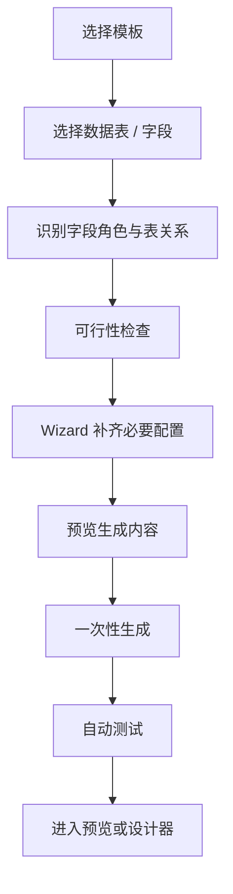
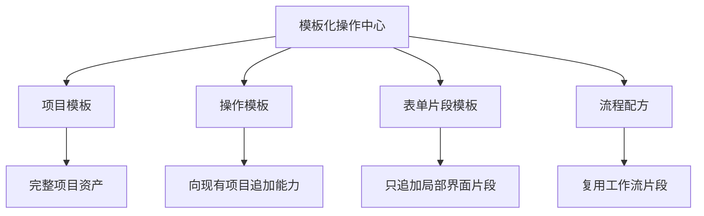
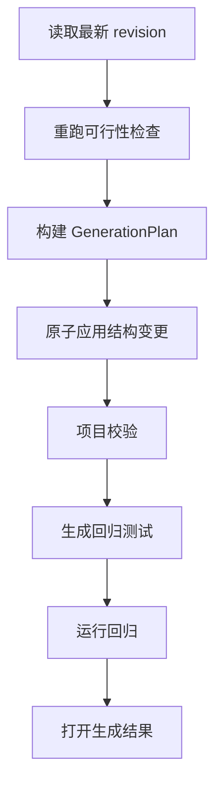

# FormFlow 模板化操作中心建设方案

**日期**：2026-07-22
**状态**：首版基线已落地，后续阶段按本文门禁迭代
**范围**：本方案不考虑智能体编排，所有能力通过确定性的模板、服务、Wizard、可行性判断和质量门禁实现。

## 1. 建设目标

将现有分散的字段生成、表单设计、数据写回、分析和机器学习能力，建设为统一的“模板化操作中心”。用户可以选择数据表、字段、控件或表关系，通过 Wizard 完成配置，并由系统自动生成可运行、可验证、可维护的表单、工作流、行为、分析结果和测试资产。

目标覆盖：

- 选中多个字段后自动生成数据录入表单。
- 有主键时自动生成查询、回填和更新表单。
- 在表格控件中编辑多行并批量更新。
- 单表录入、单表查询和更新。
- 跨表并列录入、主从表录入。
- 跨表 Join 查询、详情展示和分表更新。
- 多表批量更新和事务回滚。
- 数据概览、KPI、趋势、透视、相关性、异常检测等分析模板。
- 回归、分类、时间序列等预测模板。
- 所有模板在统一位置管理，并提供专属可行性判断和统一 Wizard。

现有系统已经具备部分基础能力：

- 数据预览页已有从字段生成录入、查询修改表单的初版入口。
- 设计器字段库支持多选字段并拖入画布。
- 已有主键校验、分页查询、单表批量写回、revision 和幂等机制。
- Python 服务已有描述统计、相关性、回归、分类、聚类、异常检测和简单时间趋势能力。
- 已有项目质量检查与回归测试生成能力。

当前主要缺口：

1. 缺少统一的操作模板协议和管理中心。
2. 缺少正式的表关系、Join 查询和跨表事务写入能力。
3. 缺少独立、可解释的模板可行性判断引擎。
4. 现有预测能力偏算法调用，尚未形成完整的训练、评估、回测、版本和输出生命周期。

## 2. 目标用户流程

模板系统提供三个统一入口：

- 数据预览：选中字段或数据表后点击“应用模板”。
- 表单设计器：选中字段、控件或表格控件后点击“生成操作”。
- 项目工作台：进入“模板化操作中心”，从完整模板库开始创建。

统一操作流程：



生成结果继续保存为标准 FormFlow v2 表单、行为、工作流、输出和测试结构，不增加第二套运行时语义。

## 3. 统一模板分类

### 3.1 项目模板

创建包含数据、表单、工作流、分析、输出和测试资产的完整项目。适合行业演示和开箱即用的完整解决方案。

现有游戏数据分析、灵活就业分析、人口预测和止回阀选型属于此类。

### 3.2 操作模板

向已有项目添加一项完整业务能力，是本轮建设重点。

示例：

- 单表录入。
- 单表查询修改。
- 表格批量更新。
- 主从表联合录入。
- 跨表查询更新。
- 数据分析看板。
- 时间序列预测。

### 3.3 表单片段模板

只向当前表单添加局部内容。

示例：

- 查询条件区。
- 查询结果表格。
- 编辑抽屉。
- 主表信息区。
- 明细编辑表格。
- KPI 卡片组。
- 预测参数区。
- 保存、重置和导出按钮组。

### 3.4 流程配方

生成可复用的工作流片段。

示例：

- 校验 → 写入。
- 查询 → Join → 回填。
- 主表新增 → 取得主键 → 明细表新增。
- 批量校验 → 批量更新 → 失败汇总。
- 训练 → 评估 → 预测 → 输出。

四类模板在一个中心统一发现和管理，但通过类型、入口和适用范围区分。



## 4. 数据录入模板

### 4.1 单表数据录入

输入：

- 一个目标表。
- 多个选中字段。
- 可选主键。
- 必填、只读、默认值和字段布局。

生成：

- 数据录入表单。
- 自动字段控件和绑定。
- 必填与类型校验。
- 新增、保存和重置按钮。
- 主键自动编号或手工输入逻辑。
- 保存工作流。
- 正常、必填缺失和主键重复测试。

可行性规则：

- 目标表必须可写。
- 所选字段必须真实存在。
- 必填字段必须被选择、自动生成或有默认值。
- 使用 upsert 时必须存在通过校验的主键。
- 无主键时可以生成纯新增表单，但禁止更新和删除。

### 4.2 单表查询与更新

输入：

- 目标表。
- 查询条件字段。
- 显示字段。
- 可编辑字段。
- 主键或唯一键。

生成：

- 查询条件区。
- 查询按钮。
- 单条查询回填表单。
- 编辑前原始数据快照。
- 更新、撤销和重置按钮。
- 乐观并发检查。
- 查无结果、多结果和更新冲突测试。

约束：

- 必须有非空唯一主键。
- 查询条件可以不是主键，但查询结果用于更新时必须携带主键。
- 多结果默认进入表格模式，不能任意选择第一条更新。

### 4.3 单表查询结果表格及批量更新

输入：

- 查询条件。
- 表格显示列。
- 可编辑列。
- 主键。
- 单次最大修改数。

生成：

- 查询区和结果表格。
- 单元格编辑、修改标记和撤销。
- 修改摘要。
- 批量校验。
- 批量更新确认。
- 部分错误定位。
- 版本冲突后的重新加载和差异比较。

第一版采用“整批原子提交”：任何一行失败则本批不写入。后续再增加“允许部分成功”模式。

必须保留：

- 稳定 `rowKey`。
- 原始值。
- 修改值。
- 数据版本。
- 每行校验结果。

### 4.4 主表—明细表录入

典型场景包括订单及订单明细、一名老师及多条任教记录。

生成：

- 主表信息区。
- 明细编辑表格。
- 添加、删除和复制明细行。
- 主键生成与外键传播。
- 主表和明细表统一提交。
- 跨表事务和失败回滚。
- 主表成功但明细失败、重复明细等测试。

### 4.5 并列跨表录入

典型场景：

- 在“教师表”登记新老师。
- 同时在“科目表”登记“劳动课”。

Wizard 需要明确：

- 两个写入是否必须同时成功。
- 两表之间是否存在关联字段。
- 科目已存在时跳过、更新还是报错。
- 老师已存在时新增、更新还是停止。
- 两表字段来自同一个表单时的映射方式。

该模板必须调用服务端跨表事务，不能用两个独立保存动作在前端模拟。

## 5. 跨表查询与更新模板

### 5.1 主数据关联查询

例如：

```text
教师表.科目ID = 科目表.科目ID
```

生成：

- 多条件查询区。
- Join 结果表格。
- 来源字段标识。
- 分页、排序和筛选。
- 导出当前完整查询结果。

### 5.2 Join 详情与分表更新

查询结果虽然显示为一条记录，但字段可能来自不同表。Wizard 必须要求：

- 每个显示字段来自哪张表。
- 哪些字段允许编辑。
- 编辑后分别更新哪张表。
- 每张表使用哪个主键。
- 多表更新是否要求原子性。

Join 结果不能直接作为普通单表行写回。每行必须保留类似以下来源信息：

```text
结果行
├── 教师表来源键：教师ID
├── 科目表来源键：科目ID
├── 教师字段修改集
└── 科目字段修改集
```

### 5.3 一对多联合查询与编辑

例如一个老师对应多条任教记录。

生成：

- 主记录详情。
- 子记录表格。
- 新增、编辑和删除子记录。
- 主记录字段单独更新。
- 子记录批量变更。
- 统一事务提交。

### 5.4 多表批量更新

适用于 Join 查询后在表格控件中修改多个来源表字段，并一次提交所有变更。

以下情况必须阻止写回：

- Join 导致同一源记录重复出现，却产生互相冲突的修改。
- 查询结果丢失源表主键。
- 聚合字段或计算字段被配置为直接写回。
- 多对多结果没有明确更新语义。

## 6. 数据分析模板

数据分析模板必须生成完整分析任务，而不只是孤立图表。

### 6.1 数据概览

自动生成：

- 行数、字段数、空值率和重复率。
- 数值字段分布。
- 分类字段频数。
- 日期范围。
- 主键健康度。
- 数据质量问题列表。
- 可筛选明细表。

该模板适用条件最低，绝大多数非空数据表均可运行。

### 6.2 KPI 汇总看板

Wizard 配置：

- 指标字段。
- 聚合方式：求和、均值、计数、去重计数、最大值、最小值。
- 分组维度。
- 时间字段。
- 筛选字段。
- 同比和环比口径。

生成 KPI 卡片、趋势图、分组图、明细表和导出结果。

### 6.3 分组对比分析

示例：

- 不同部门的平均工资。
- 不同课程的老师数量。
- 不同地区的销售额。

可行性要求：

- 至少一个分类维度。
- 至少一个数值指标或可计数记录。
- 维度基数过高时提示使用 Top N 或分层筛选。

### 6.4 交叉分析和透视分析

Wizard 选择行维度、列维度、指标、聚合方式、小计和总计，生成透视表、热力图和明细钻取。

### 6.5 趋势分析

要求：

- 可解析的日期或时间字段。
- 数值指标或记录计数。
- 明确时间粒度：日、周、月、季度或年。

生成趋势图、移动平均、增长率、周期对比和异常点提示。

### 6.6 相关性分析

要求至少两个有效数值字段，并检查样本量、空值比例、常量字段和极端异常值。

生成相关矩阵、散点图和高相关字段列表，并明确提示“相关不等于因果”。

### 6.7 异常检测

配置分析字段、分组字段、异常比例或阈值，以及是否排除特定记录。

生成异常记录表、异常分数、分布图、人工确认字段和可选的异常标记写回流程。

### 6.8 聚类和分群

要求：

- 足够数量的数值特征。
- 样本量不小于聚类数量。
- 明确空值处理和标准化策略。

生成聚类参数表单、群组概览、群组特征对比、明细记录和可选群组标签写回。

### 6.9 跨表分析

在正式关系模型基础上支持：

- 主表与明细表汇总。
- 事实表与维度表关联。
- 多表筛选。
- Join 后 KPI、趋势和分组分析。

第一版只支持明确声明的等值 Join，不允许自由 SQL。

## 7. 数据预测模板

当前 Python 服务已有回归、分类、聚类和简单时间趋势能力，但现有时间序列主要提供移动平均和线性趋势，不应直接包装为完整未来预测。

### 7.1 P1：基础预测模板

#### 数值回归预测

用途包括根据工时预测收入、根据运营指标预测流水、根据人口指标预测需求。

Wizard 配置：

- 目标字段。
- 特征字段。
- 训练/验证比例。
- 缺失值处理。
- 是否标准化。
- 输出表和预测字段名称。

生成：

- 参数表单。
- 训练工作流。
- R²、MAE 和 RMSE。
- 实际值与预测值对比图。
- 预测结果表。
- 可选批量写回。

#### 分类预测

用途包括流失、违约、审批结果和风险等级预测。

生成：

- 特征选择。
- 类别分布检查。
- 混淆矩阵。
- Accuracy、Precision、Recall 和 F1。
- 概率与分类结果。
- 阈值调节控件。

#### 简单时间序列预测

要求：

- 一个时间字段。
- 一个数值目标字段。
- 时间间隔基本连续。
- 达到最低历史期数。

第一版提供趋势外推、移动平均、季节性基线、预测区间和回测结果，不能把趋势统计直接标记为可靠预测。

### 7.2 P2：正式时序预测

增加：

- 季节性检测。
- 缺失时间点补齐。
- 多种候选模型。
- 滚动回测。
- 自动选择模型。
- 预测置信区间。
- 多情景参数。
- 按分组分别预测。

质量门禁至少包含：

- 历史点数量。
- 时间顺序和重复时间检查。
- 训练/测试时间泄漏检查。
- MAE、RMSE 和 MAPE。
- 与“沿用上期值”基线比较。
- 预测范围与负数处理策略。
- 模型版本、数据版本和运行时间记录。

### 7.3 P3：业务预测模板

在基础预测能力上封装：

- 销量和需求预测。
- 收入预测。
- 人员需求预测。
- 库存消耗预测。
- 工期预测。
- 流失风险预测。
- 设备故障风险预测。
- 人口情景预测。

业务模板只提供参数预设、可行性规则和展示方式，不复制底层算法实现。

## 8. 表关系模型

跨表模板需要正式的关系定义。建议在项目结构中增加向后兼容的可选关系目录：

```ts
interface DataRelation {
  id: string;
  name: string;
  left: {
    tableId: string;
    sheetName: string;
    fields: string[];
  };
  right: {
    tableId: string;
    sheetName: string;
    fields: string[];
  };
  cardinality: 'one-to-one' | 'one-to-many' | 'many-to-one' | 'many-to-many';
  defaultJoinType: 'inner' | 'left';
  integrity: 'enforced' | 'checked' | 'informational';
  onDelete: 'restrict' | 'set-null' | 'cascade';
}
```

第一阶段限制：

- 只支持字段数量一致的等值关联。
- 优先支持一对一、一对多和多对一。
- 多对多只允许查询，默认不允许通过 Join 结果直接更新。
- Join 输出必须保留每个源表的主键和来源信息。
- 关系定义保持可选，以兼容现有 FormFlow v2 项目。

关系管理器应支持：

- 自动建议疑似关系。
- 用户确认关系。
- 检查关联字段类型兼容性。
- 检查父表键是否唯一。
- 检查孤儿记录。
- 展示关系被哪些模板、表单和流程使用。

## 9. 跨表事务能力

现有单表批量接口不足以保证多表写入同时成功或同时失败。需要增加服务级多表事务操作：

```ts
data_rows.transaction({
  projectId,
  baseRevision,
  operations: [
    {
      tableId: 'teachers',
      sheetName: '教师表',
      adds: []
    },
    {
      tableId: 'subjects',
      sheetName: '科目表',
      adds: []
    }
  ],
  idempotencyKey
})
```

实现要求：

- 一次锁定项目 revision。
- 预检全部操作。
- 校验所有主键、关联完整性、字段类型和权限。
- 所有操作先在项目副本上应用。
- 全部通过后一次提交项目包。
- 任一失败则零写入。
- 返回每张表的变更数和生成键。
- 支持事务内把前一步生成键传给后续写入。
- 删除仍遵守破坏性确认机制。
- 限制单次总变更量。
- 保存审计记录和失败原因。

表格批量更新和跨表表单必须调用统一事务服务，不能在前端自行模拟回滚。

## 10. 模板定义协议

建议所有操作模板采用同一个声明协议：

```ts
interface OperationTemplateDefinition {
  id: string;
  version: string;
  category: string;
  name: string;
  description: string;

  selectionContract: SelectionContract;
  parameterSchema: WizardSchema;
  feasibilityRules: FeasibilityRule[];

  analyze(context): FeasibilityReport;
  plan(context, parameters): GenerationPlan;
  generate(plan): GeneratedArtifacts;
  validate(artifacts): ValidationReport;

  migrations?: TemplateMigration[];
}
```

每个模板至少声明：

- 支持选择表、字段、控件、关系还是现有表单。
- 最少和最多选择数量。
- 是否需要主键。
- 是否允许只读表。
- 是否需要时间字段、数值字段或目标字段。
- 是否支持跨表。
- 会生成哪些表单、工作流、行为、输出和测试。
- 是否包含数据写回或删除。
- 是否需要确认。
- 兼容的 FormFlow 版本。
- 模板版本和升级策略。

所有生成物记录模板来源：

```ts
generatedBy: {
  templateId: 'cross-table-entry';
  templateVersion: '1.0.0';
  instanceId: '...';
  generatedAt: '...';
}
```

由此支持：

- 查看模板生成了什么。
- 定位模板实例。
- 重新运行 Wizard。
- 比较模板升级。
- 只更新仍由模板管理的部分。
- 避免覆盖用户后续的手工修改。

## 11. 专属可行性判断引擎

可行性判断应是独立核心服务，不能散落在 React 页面中。

### 11.1 结果等级

- `ready`：可以直接生成。
- `needs-configuration`：补充参数后可以生成。
- `warning`：可以生成，但存在明显风险。
- `blocked`：当前数据条件下不能生成。
- `not-applicable`：选择对象与模板不匹配。

### 11.2 判断维度

数据结构：

- 是否存在表和字段。
- 字段是否真实存在。
- 类型是否确定。
- 主键是否配置、非空和唯一。
- 表是否只读。
- 是否存在关系。
- Join 字段类型是否一致。

写入安全：

- 写入模式是新增还是 upsert。
- 更新是否携带稳定主键。
- Join 更新是否能追踪到源记录。
- 是否出现重复源记录。
- 是否试图写回聚合字段或计算字段。
- 是否需要跨表事务。

分析适用性：

- 数值字段数量。
- 分类字段基数。
- 时间字段有效率。
- 空值率。
- 样本量。
- 数据是否全为常量。
- 时间序列是否连续。

预测适用性：

- 目标字段类型。
- 样本量和特征数量比例。
- 类别是否严重失衡。
- 是否存在数据泄漏字段。
- 时间是否排序。
- 预测期是否合理。
- 是否能做训练和验证切分。
- 模型指标是否优于基线。

生成冲突：

- 表单 ID 是否重复。
- 组件名称是否冲突。
- 工作流 ID 是否冲突。
- 现有表单是否已经绑定字段。
- 模板是否会覆盖用户修改。
- release 默认表单是否受到影响。

### 11.3 报告结构

```ts
interface FeasibilityReport {
  status: 'ready' | 'needs-configuration' | 'warning' | 'blocked' | 'not-applicable';
  score: number;
  summary: string;
  checks: Array<{
    code: string;
    status: 'passed' | 'warning' | 'failed';
    message: string;
    path?: string;
    fix?: SuggestedFix;
  }>;
  inferredRoles: FieldRole[];
  requiredQuestions: WizardQuestion[];
  generationPreview?: GenerationSummary;
}
```

每条失败必须说明原因、影响的能力、修复方式以及修复后是否需要重新检查。

## 12. Wizard 设计

不同模板不应各自实现独立 Modal，而应采用 Schema 驱动的统一 Wizard Shell。

### 第一步：选择模板

展示模板用途、所需条件、生成内容、数据写入风险和当前选择的适用状态。

### 第二步：选择数据范围

支持当前选中字段、当前 Sheet、多张表、已声明关系和手工选择关联字段。

### 第三步：字段角色映射

根据模板显示：

- 主键。
- 查询条件。
- 可编辑字段。
- 只读字段。
- 维度。
- 指标。
- 时间。
- 预测目标。
- 预测特征。
- Join 左右键。

### 第四步：业务语义

跨表录入需要配置：

- 新增、更新或 upsert。
- 已存在时如何处理。
- 两表是否必须同时成功。
- 子表是否允许空集合。

预测需要配置：

- 预测多少期。
- 时间粒度。
- 训练/验证比例。
- 评价指标。
- 是否写回结果。

### 第五步：生成内容预览

明确列出：

- 新增几个表单。
- 新增哪些组件。
- 新增哪些工作流。
- 新增哪些行为。
- 新增哪些输出。
- 新增哪些测试。
- 是否修改现有配置。
- 是否会写入或删除业务数据。

### 第六步：验证与创建



## 13. 模板化操作中心页面

建议新增一级入口“模板中心”或“操作中心”，分区包括：

- 推荐模板。
- 数据录入。
- 查询与维护。
- 跨表业务。
- 数据分析。
- 数据预测。
- 流程配方。
- 表单片段。
- 已安装模板实例。
- 自定义模板。

模板卡显示：

- 模板名称和用途。
- 适用对象。
- 当前项目可行性。
- 缺少条件。
- 生成物数量。
- 风险等级。
- 最近使用时间。

已安装模板实例支持：

- 查看生成物。
- 打开表单。
- 重新配置。
- 检查漂移。
- 升级模板。
- 从模板管理中脱离。
- 删除模板实例生成物。

删除或覆盖必须继续遵守现有破坏性确认机制。

## 14. 实施阶段

### 阶段 0：模板协议和数据语义，1～2 周

- [x] 定义四层模板分类。
- [x] 定义 `OperationTemplateDefinition`。
- [x] 定义 `GenerationPlan`。
- [x] 定义 `FeasibilityReport`。
- [x] 定义模板来源元数据。
- [x] 增加关系模型。
- [x] 建立模板注册中心。
- [x] 建立纯函数式可行性检查框架。
- [x] 为现有单表生成器增加适配层。

验收：

- [x] 旧项目无需迁移即可打开。
- [x] 现有生成表单功能通过新模板协议运行。
- [x] UI 和 MCP 能读取同一份模板目录。

### 阶段 1：单表 CRUD 模板，2～3 周

- [x] 单表录入模板。
- [x] 单表查询回填模板。
- [x] 单表查询修改模板。
- [x] 表格批量编辑模板。
- [x] 主键配置和修复引导。
- [x] Schema 驱动 Wizard Shell。
- [x] 生成计划预览。
- [x] CRUD 自动测试。

验收：

- [x] 选中多个字段，五分钟内生成可运行录入表单。
- [x] 有主键时可查询、回填和修改。
- [x] 表格可跨页修改并一次批量提交。
- [x] 无主键时明确禁止更新类模板。

### 阶段 2：关系与跨表查询，2～3 周

- [x] 关系管理器。
- [x] 关系自动建议。
- [x] Join 查询服务。
- [x] Join 结果来源追踪。
- [x] 主从详情模板。
- [x] 跨表查询模板。
- [x] Join 更新可行性判断。
- [x] 跨表查询分页、筛选、排序和导出。

验收：

- [x] 教师表和科目表可以声明关系。
- [x] 可以生成联合查询表单。
- [x] 每个字段都能定位到真实来源表和源主键。
- [x] 多对多模糊更新会被阻止。

### 阶段 3：跨表事务写入，2～3 周

- [x] 多表事务数据服务。
- [x] 并列跨表录入。
- [x] 主从表录入。
- [x] 跨表分字段更新。
- [x] 表格多表批量更新。
- [x] 失败回滚。
- [x] 冲突处理和差异提示。
- [x] 审计与确认。

验收：

- [x] 老师信息和劳动课信息同时成功或同时失败。
- [x] 子表失败不会留下孤立主表记录。
- [x] 重试不会重复插入。
- [x] revision 冲突不会覆盖其他用户修改。

### 阶段 4：数据分析模板，2～3 周

- [x] 数据概览。
- [x] KPI 看板。
- [x] 分组对比。
- [x] 透视分析。
- [x] 趋势分析。
- [x] 相关性分析。
- [x] 异常检测。
- [x] 跨表汇总分析。

验收：

- [x] 每个模板有专属字段角色和可行性规则。
- [x] 自动生成参数表单、结果区、图表和明细。
- [x] 分析结果记录数据版本和配置。
- [x] 输入数据变化后明确提示结果过期。

### 阶段 5：数据预测模板，3～4 周

- [x] 统一训练、评估和预测任务模型。
- [x] 回归预测。
- [x] 分类预测。
- [x] 基础时间序列预测。
- [x] 训练/验证切分。
- [x] 指标和基线比较。
- [x] 模型与数据版本记录。
- [x] 预测结果表和图表。
- [x] 可选写回。
- [x] 预测回归测试。

验收：

- [x] 不满足样本量时拒绝生成预测模板。
- [x] 评价指标不可缺失。
- [x] 时间序列必须做时间顺序回测。
- [x] 预测结果标识模型、训练数据版本和生成时间。
- [x] 低于基线的模型不能默认标记为可用。

### 阶段 6：模板生命周期，1～2 周

- [x] 模板实例追踪。
- [x] 模板漂移检测。
- [x] 安全重新生成。
- [x] 模板版本升级。
- [x] 自定义参数预设。
- [x] 导入和导出模板。
- [x] 使用统计和失败原因统计。
- [x] 模板文档和示例数据。见 [`docs/templates/operation-template-catalog.md`](./templates/operation-template-catalog.md) 与 [`examples/template-operation-center/`](../examples/template-operation-center/)。

## 15. 测试矩阵

### 15.1 可行性单元测试

- [x] 无表。
- [x] 无字段。
- [x] 无主键。
- [x] 重复主键。
- [x] 空主键。
- [x] 只读表。
- [x] 字段类型不匹配。
- [x] 关系不存在。
- [x] 样本量不足。
- [x] 时间字段不可解析。

### 15.2 生成快照测试

验证生成的表单、控件、绑定、行为、工作流、输出和测试套件。

### 15.3 运行测试

- [x] 新增成功。
- [x] 查询成功。
- [x] 查询无结果。
- [x] 查询多结果。
- [x] 更新冲突。
- [x] 批量更新失败回滚。
- [x] 跨表第二步失败回滚。
- [x] 预测任务失败。
- [x] 预测结果过期。

### 15.4 E2E 标准场景

1. 从员工表选择六个字段生成录入表单。
2. 从有主键的员工表生成查询修改表单。
3. 在查询结果表格修改十行并批量提交。
4. 新教师登记，同时新增劳动课。
5. 查询教师及所授科目并分别更新两张表。
6. 生成部门人数和平均工资分析看板。
7. 从月度销量生成未来六期预测。
8. 样本量不足时展示不可行原因，不生成错误项目。

## 16. 建议优先级

第一优先级：

- 统一模板协议。
- 可行性引擎。
- 单表录入。
- 单表查询修改。
- 表格批量更新。
- Schema 驱动 Wizard。

第二优先级：

- 关系模型。
- 跨表事务。
- 主从和并列跨表录入。
- Join 查询和更新。

第三优先级：

- 数据概览、KPI、趋势和透视等数据分析模板。

第四优先级：

- 回归、分类和时间序列预测。
- 模板升级和自定义模板生态。

数据预测依赖稳定的数据角色、任务输出、运行记录和质量门禁。先完成模板协议、关系模型和任务生命周期，后续分析和预测才能复用同一套基础设施。

## 17. 现有实现复用点

- `ui/src/services/formGeneration/formScaffold.ts`：单表表单生成和保存流程。
- `ui/src/pages/editor/DataPreviewPage.tsx`：现有数据生成表单入口和 Wizard 雏形。
- `ui/src/designer/Toolbox.tsx`：设计器字段多选与批量拖入。
- `server/src/services/formflow-tool-registry.ts`：主键、查询、单表批量写回、表单生成和质量工具。
- `server/src/services/project-quality.ts`：项目质量诊断和发布门禁基础。
- `python-service/src/ml_engine.py`：分析、回归、分类、聚类和异常检测算法基础。

整体无需推翻现有架构。实施重点是把零散能力提升为统一、可发现、可判断、可预览、可验证、可升级的模板产品层。

## 18. 首版实施基线（2026-07-22）

本方案的首版基础设施已经落地，后续模板不得再绕过以下公共能力另建实现：

- 服务端 `template-operation-center.ts` 提供统一模板协议、19 个内置操作模板、注册目录、字段角色推断、专属可行性报告、生成计划、冲突检查和原子应用。
- 项目包以向后兼容的可选字段保存 `relations`、`templateInstances`、`analysisTasks` 和 `modelRuns`；目录包和前端 ZIP 导入导出使用同一结构。
- MCP 新增操作模板目录、`template.analyze/plan/apply`、模板实例漂移/脱离/删除、关系管理、受限 Join、跨表事务和分析预测运行历史工具。所有写操作继续受 revision、幂等、权限和破坏性确认约束。
- `data_rows.transaction` 在项目副本中预检最多 1,000 个变更，支持事务内生成键引用，全部成功后一次提交；任一 Sheet 失败时不写入。
- 关系查询只接受已声明的等值关系，支持 `inner`/`left`、分页和搜索，并在每行 `__sources` 中保存各来源表主键，避免把 Join 行误当作单表记录写回。
- 项目工作台新增“模板中心”，前端通过 MCP 读取同一模板目录，并以统一向导完成数据范围、字段、关系、参数、可行性检查、生成预览和创建。
- 回归、分类和基础时序预测增加训练/验证或时间顺序回测、完整指标、基线比较、模型/数据/配置版本记录；未优于基线的结果不会标记为可用。
- 模板实例记录资源清单和生成时指纹，可检查资源缺失或手工修改；删除实例时只删除仍明确属于该实例的生成物。

首版完成的是公共协议和可运行纵向链路，而不是宣布 P2/P3 算法和模板生态冻结。第 14 节中尚未勾选的高级能力仍是后续增量范围，尤其包括关系自动建议、多对多查询语义、允许部分成功的批量策略、多候选正式时序模型、模板升级迁移、自定义模板导入以及更丰富的行业预设。每项进入完成状态前仍须满足对应阶段验收和第 15 节测试矩阵。

当前验证基线：

- 模板、关系、事务、生命周期和预测门禁专项测试 12 项通过。
- MCP/模板联合回归 30 项通过。
- 前端 TypeScript 检查和生产构建通过。
- 仓库全量测试共 440 项，其中 435 项通过、2 项跳过；3 项失败由工作区中已删除的设备巡检回归夹具导致，与本方案改动无关。
