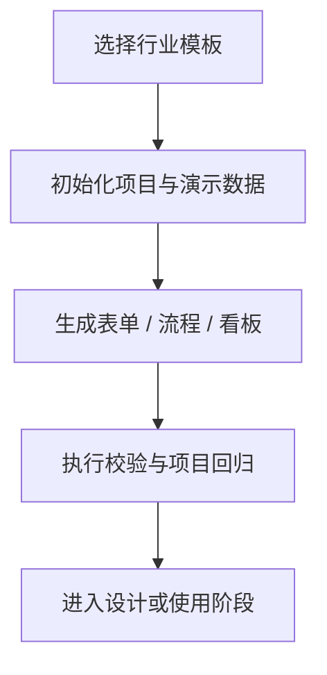
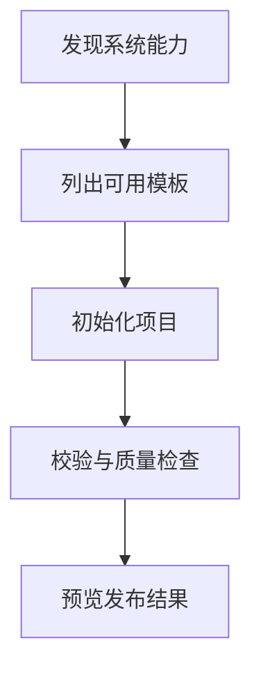

# FormFlow 四行业内置模板

项目创建向导和 MCP `project.initialize` 共享以下四个全新行业模板。每个模板都包含可写录入表单、查询表单、编辑表单、产品化分析流程、KPI、图表、明细表和可导出结果。



| 模板 ID | 行业 | 表单场景 | 分析与可视化 |
|---|---|---|---|
| `game_analytics` | 游戏数据分析 | 事件录入、玩家档案编辑、活动创建、付费订单查询 | 活跃、付费、关卡、渠道和活动看板 |
| `flexible_employment` | 灵活就业分析 | 工作记录录入、从业者档案编辑、收入结算查询、保障调查录入 | 收入、工时、稳定性和保障覆盖看板 |
| `china_population_forecast` | 中国人口预测 | 情景参数录入、省级数据查询、预测结果对比 | 2000—2025 历史与 2026—2050 三情景看板 |
| `check_valve_selection` | 止回阀选型 | 工况录入、产品目录查询、选型结果确认、零件库存查询 | 约束筛选、候选评分、报价和交期看板 |

## 统一约束

- 业务交互只绑定 FormFlow 工作流和规则 DSL，不包含自定义 JS 节点或控件内联脚本。
- 所有可编辑 Sheet 使用非空唯一业务主键。
- 模板内置适中规模的确定性数据和回归结果，可在创建后直接运行。
- 中国人口示例将国家统计局历史口径与 Mock 预测分开标记，所有预测行均注明“非官方预测”。
- 旧模板 ID 仅作为隐藏兼容入口，直接解析到新行业模板，不保留旧业务内容。

## MCP 创建

先调用 `system.capabilities.get` 和 `catalog.templates.list`，再调用：

```json
{
  "id": "game_ops_demo",
  "name": "游戏运营分析",
  "templateId": "game_analytics",
  "idempotencyKey": "game-ops-demo-v1"
}
```

创建后运行 `project.validate`、`project.quality.inspect` 和项目回归。发布前只调用 `release.preview`，不得自动发布。


