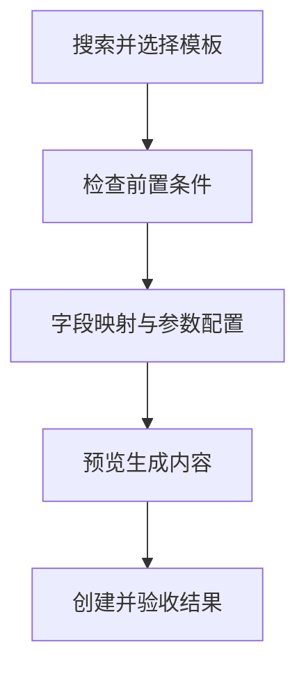

# 模板化操作中心使用手册

模板化操作中心用于从现有数据表快速生成录入、维护、跨表、分析和预测能力。入口位于项目编辑器的“模板中心”。



## 推荐流程

1. 在“模板库”按名称或用途搜索模板。
2. 选择数据表、Sheet、字段和关系；必填项会在原位置标出。
3. 点击“检查可行性”。主键、只读状态、字段类型、样本量或关系有问题时，系统会给出路径和修复建议。
4. 点击“预览生成内容”，确认表单、流程、输出和测试数量及 ID 冲突。
5. 创建模板。分析与预测模板会自动首次运行，并跳转到“分析结果”。
6. 在“已安装实例”检查漂移、重新生成或脱离管理；在“数据关系”管理 Join；在“分析结果”查看图表、明细和过期状态。

失败不会只显示短暂提示。页面顶部会保留错误码、字段路径、复制诊断和重试入口。

## 模板目录

| 类别 | 模板 | 关键条件 | 主要生成物 |
| --- | --- | --- | --- |
| 录入 | 单表数据录入 | 至少一张可写表和一个字段 | 类型化表单、校验保存流程、测试 |
| 维护 | 单表查询修改 | 非空唯一主键、可写表 | 主键查询回填、原值保留、并发安全更新 |
| 维护 | 表格批量更新 | 非空唯一主键、可写表 | 跨页变更集、差异摘要、原子批量提交 |
| 跨表 | 并列跨表录入 | 至少两张可写表 | 单事务多表写入 |
| 跨表 | 主从表录入 | 两张表和已声明关系 | 主键传播、主表与明细原子提交 |
| 跨表 | 主从详情 | 两张表和已声明关系 | 主记录定位、从表明细关联展示 |
| 跨表 | 跨表查询与分表更新 | 已声明关系、可定位源主键 | Join 查询、来源追踪、分表更新 |
| 跨表 | 多表批量更新 | 每张可写表均具备非空唯一主键 | 跨表变更集、差异摘要、原子批量提交 |
| 分析 | 数据概览、KPI、分组、透视、趋势、相关性、异常、跨表汇总 | 对应字段角色和最低样本量 | 参数区、指标卡、图表、明细、数据版本 |
| 预测 | 回归、分类、时间序列 | 最低样本量、目标与特征；时间序列还需可解析时间 | 指标、基线、预测表、图表、模型与数据版本 |

## 示例：教师与科目

导入 [teachers.json](../../examples/template-operation-center/teachers.json) 和 [subjects.json](../../examples/template-operation-center/subjects.json)，分别把 `教师ID`、`科目ID` 配置为主键。关系管理器会建议：

```text
teachers/教师/科目ID → subjects/科目/科目ID
基数：many-to-one
```

确认关系后，可创建“跨表查询与分表更新”或“跨表汇总分析”。每条 Join 结果都会携带两张来源表的真实主键；多对多关系只允许查询，不允许模糊写回。

## 示例：销售分析与预测

导入 [sales.json](../../examples/template-operation-center/sales.json)：

- KPI：指标选 `销售额`、`利润`，维度选 `区域`。
- 分组对比：维度选 `区域`，指标选 `销售额`，聚合选 `sum`。
- 透视分析：行维度选 `区域`，列维度选 `月份`，指标选 `销售额`。
- 回归预测：目标选 `利润`，特征选 `销售额` 和 `客流量`。

保存为参数预设后，同一项目可重复使用。输入数据变化时，旧结果会显示“结果已过期”，不应继续用于决策。

## 安全边界

- 更新模板必须具备经过校验的非空唯一主键。
- 多表写入先在项目副本中完成全部预检，任一步失败均不提交。
- 删除、覆盖漂移资源等操作需要明确确认。
- 安全重新生成默认保留手工修改；只有用户明确选择覆盖后才重建。
- 预测未优于基线时会标记为不可用。
