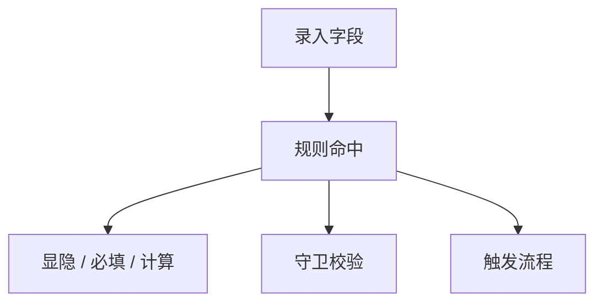

# 典型用例



## 条件显隐

```text
when $部门 == "技术部" -> show(@tech-stack); require($技术栈)
else -> hide(@tech-stack); clear($技术栈)
```

## 计算字段

```text
compute $合计 = $数量 * $单价 watch($数量, $单价)
```

## 级联选项

```text
on change($省份) -> options($城市, "city_table", "省份", $省份)
```

## 加载默认值

```text
on load -> set($状态, "草稿"); set($创建方式, "手动录入")
```

## 查询按钮守卫

```text
before click("lookup") -> requireAny($教师ID, $姓名)
```

## 提交前守卫

```text
before submit -> require($姓名, $手机号); validate($邮箱, email); range($年龄, 18, 60); length($姓名, 2, 20)
```

## 跨字段比较

```text
before submit -> compare($结束日期, ">=", $开始日期)
```

## 提交流程

```text
on submit -> run("save_employee"); message("提交完成", success)
```

## 反例：`else` 没有紧跟 `when`

```text
when $部门 == "技术部" -> show(@tech-stack)
on load -> set($状态, "草稿")
else -> hide(@tech-stack)
```

为什么错：`else` 只能绑定紧邻上一条 `when`，中间插入其他规则后，它就失去归属了。

## 反例：动作分隔符写成逗号

```text
when $部门 == "技术部" -> show(@tech-stack), require($技术栈)
```

为什么错：DSL 的动作分隔符是 `;`，不是逗号。

正确写法：

```text
when $部门 == "技术部" -> show(@tech-stack); require($技术栈)
```

## 反例：`watch(...)` 依赖写不全

```text
compute $合计 = $数量 * $单价 watch($数量)
```

为什么危险：这里只监听了 `$数量`，修改 `$单价` 时不会重算 `$合计`。

正确写法：

```text
compute $合计 = $数量 * $单价 watch($数量, $单价)
```

## 反例：把 DSL 当成通用脚本

```text
compute $结果 = fetch("/api/search") watch($关键词)
```

为什么错：DSL 不支持任意异步调用，也不会开放浏览器全局对象。需要网络请求时，应改用事件脚本或流程。

## 反例

- 把 `else` 写远了
- 动作之间用逗号分隔
- `watch(...)` 漏掉真实依赖
- 在 `on submit` 中再次提交
- 用 DSL 代替复杂异步脚本

## 旧写法迁移

| 旧写法 | 规范写法 |
| --- | --- |
| `otherwise -> hide 技术栈` | `else -> hide(@tech-stack)` |
| `show 技术栈, require 技术栈` | `show(@tech-stack); require($技术栈)` |
| `on 省份 change -> ...` | `on change($省份) -> ...` |
| `compute 合计 = ... on change(数量)` | `compute $合计 = ... watch($数量)` |
