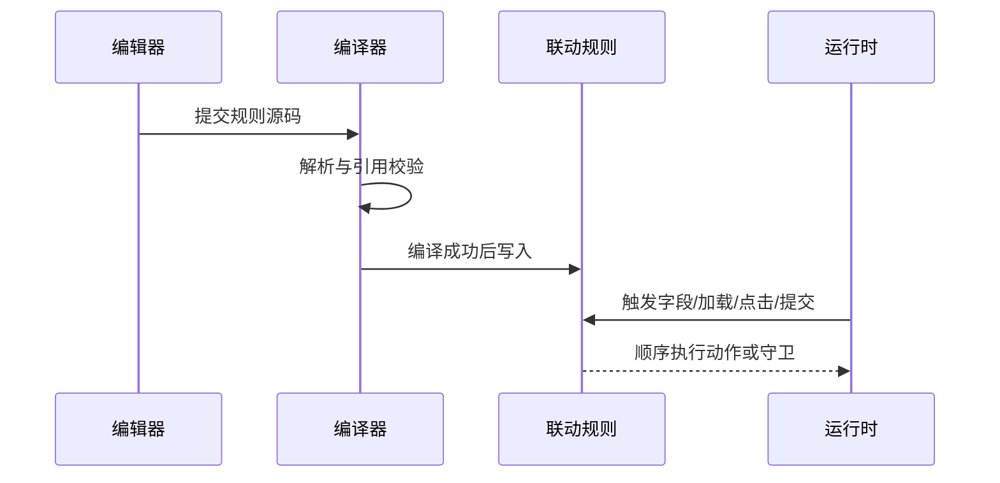
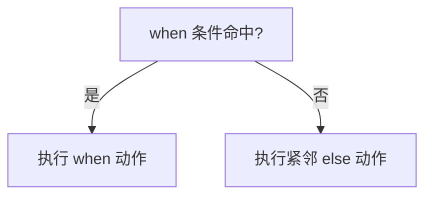
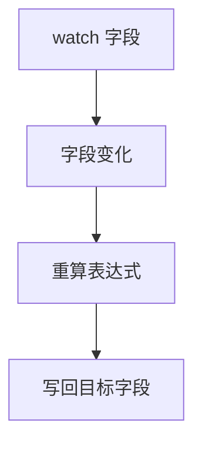

# 执行逻辑

## 编辑态 → 应用态 → 运行态



这个三阶段的真实语义是：

1. 编辑态只负责写源码、做静态诊断
2. 应用态才会把源码编译成运行时联动规则
3. 运行态只执行已经编译成功的结果，不再解释自由文本

所以“编辑器里看起来像对的”不算通过，只有 lint、引用校验、编译都通过后，运行时才会真的执行。

## 运行时触发顺序

不同触发器虽然都写在一份 DSL 里，但进入运行时后的切入点不同：

- 字段值变化：命中 `when` / `else` / `on change`
- 依赖字段变化：命中 `compute ... watch(...)`
- 表单初次进入运行态：命中 `on load`
- 点击某个按钮前：命中 `before click(...)`
- 提交动作发生前：命中 `before submit`
- 提交动作确认发生后：命中 `on submit`

> [!IMPORTANT]
> `before submit` 和 `on submit` 不是一回事。前者是“还有机会阻断”，后者是“提交事件已经成立，适合做收尾联动或跑流程”。

## `else` 的真实语义

`else` 不是独立条件，它只反向紧邻上一条 `when`。



因此下面这种写法会被认定为结构错误，而不是“另起一个反向分支”：

```text
when $部门 == "技术部" -> show(@tech-stack)
on load -> set($状态, "草稿")
else -> hide(@tech-stack)
```

## `compute ... watch(...)` 的触发链



`compute` 有两个容易误解的点：

- 不是目标字段变化时重算，而是 `watch(...)` 里的依赖字段变化时重算
- 不是“自动推导依赖”，依赖必须显式写出来

如果你写了：

```text
compute $合计 = $数量 * $单价 watch($数量)
```

那么只改 `$单价` 时，不会触发重算，因为 `$单价` 没有出现在 `watch(...)` 里。

## 一行内动作的执行次序

同一条规则里，动作严格按书写顺序执行：

```text
when $部门 == "技术部" -> show(@tech-stack); require($技术栈); message("请补全技术栈", info)
```

上面不是“并发三件事”，而是：

1. 先显示控件
2. 再把字段设为必填
3. 最后提示用户

如果顺序会影响结果，就必须按你想要的先后写出来。

## 诊断规则

- 错误：阻止应用
- 警告：允许应用，但提示迁移、循环或风险

常见诊断编号：

| 编号范围 | 含义 |
| --- | --- |
| `FFR000–099` | 语法或参数错误，无法编译 |
| `FFR100–199` | 旧语法迁移警告 |
| `FFR200–299` | 字段、控件、流程、数据表引用错误 |
| `FFR300–399` | 循环、递归或危险语义 |

常见阻断原因：

- 语法无法识别
- `else` 没有紧跟 `when`
- 引用了不存在的字段、控件、流程、数据表
- `on submit` 里又试图提交

## 什么时候该停在 DSL 之外

下面这些不是 DSL 的强项，文档里要直接劝退：

- 需要等待网络请求返回再继续判断
- 需要遍历长数组做复杂聚合
- 需要在多个业务对象之间维护中间状态
- 需要完整脚本能力处理异常分支

这时正确做法不是“再多堆几条规则”，而是切到流程或事件脚本。
