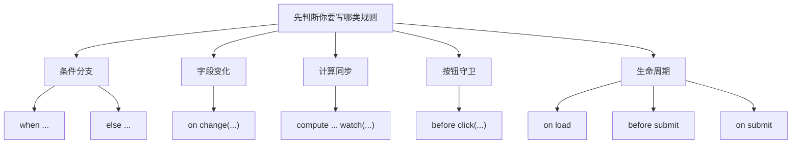

# 完整语句模型

```ebnf
statement         = when-rule | else-rule | change-rule | compute-rule | button-guard-rule | lifecycle-rule ;
when-rule         = "when", field-ref, operator, value, "->", action-list ;
else-rule         = "else", "->", action-list ;
change-rule       = "on", "change", "(", field-ref, ")", "->", action-list ;
compute-rule      = "compute", field-ref, "=", expression, "watch", "(", field-list, ")" ;
button-guard-rule = "before", "click", "(", string, ")", "->", guard-action-list ;
lifecycle-rule    = ("on load" | "before submit" | "on submit"), "->", action-list | guard-action-list ;
```

> [!NOTE]
> 这只是顶层句型。真正能不能应用，还要继续通过字段、控件、流程、数据表引用校验，以及动作参数校验。



## 怎么读一条规则

一条规则通常由 4 段组成：

1. 触发器：什么时候执行
2. 条件：在什么值或状态下命中
3. 箭头：`->`，表示“命中后做什么”
4. 动作：显隐、必填、计算、校验、运行流程

对应到几种常见句型：

- `when 条件 -> 动作`
- `else -> 动作`
- `on change(字段) -> 动作`
- `compute 目标字段 = 表达式 watch(依赖字段...)`
- `before click("按钮") -> 守卫动作`
- `on load / before submit / on submit -> 动作`

## 语法硬约束

- 一行一条规则；空行忽略。
- 多个动作之间必须用 `;`，不能用逗号。
- `else` 必须紧跟上一条 `when`，中间不能插别的规则。
- `compute` 的目标必须是字段，依赖必须显式写在 `watch(...)`。
- 字段写为 `$字段` 或 `$form.字段`；控件写为 `@控件ID`。
- 按钮守卫的按钮名写在 `before click("按钮名")` 的引号里。
- 注释只支持整行 `#` 开头；不能把行尾任意片段当注释。

## 参数与引用约束

- `show` / `hide` / `enable` / `disable` 期待的是控件引用，如 `@tech-stack`。
- `require` / `optional` / `clear` / `set` / `compare` 期待的是字段引用，如 `$技术栈`。
- `run("...")` 的参数是流程 ID，不是流程标题。
- `options($目标, "表ID", "筛选字段", 筛选值)` 中第二个参数是数据表 ID，不是展示名称。
- `message("内容", level)` 的 `level` 必须是系统认识的消息级别。

## 关键词

| 关键词 | 含义 |
| --- | --- |
| `when` | 条件触发 |
| `else` | 紧邻上一条 `when` 的反向分支 |
| `on change` | 字段变化直接触发 |
| `compute` | 计算目标字段 |
| `watch` | 声明 `compute` 的依赖字段 |
| `before click` | 按钮点击前守卫 |
| `on load` | 表单加载时执行 |
| `before submit` | 提交前执行 |
| `on submit` | 提交时执行 |

## 常用运算符

| 运算符 | 语义 |
| --- | --- |
| `==` / `!=` | 相等 / 不相等 |
| `>` / `>=` | 大于 / 大于等于 |
| `<` / `<=` | 小于 / 小于等于 |
| `contains` / `not contains` | 包含 / 不包含 |
| `starts with` / `not starts with` | 以指定文本开头 / 不以指定文本开头 |
| `ends with` / `not ends with` | 以指定文本结尾 / 不以指定文本结尾 |
| `is empty` / `is not empty` | 空 / 非空 |

## 动作与守卫

- 常规动作：`show(`、`hide(`、`enable(`、`disable(`、`require(`、`optional(`、`clear(`、`set(`、`message(`、`run(`、`options(`
- 守卫动作：`requireAny(`、`requireDirty(`、`keepReadonly(`、`validate(`、`range(`、`length(`、`compare(`

> [!NOTE]
> 守卫动作主要出现在 `before submit` 和 `before click(...)` 中，用来阻断无效提交或无效点击。

## 适用边界

适合写进 DSL 的，是“轻量、确定、围绕当前表单状态”的规则，例如：

- 某个字段命中条件后显示另一个控件
- 输入数量和单价后自动计算合计
- 选择省份后刷新城市下拉框
- 提交前要求姓名、手机号、邮箱满足格式

不适合写进 DSL 的，是这些更重的逻辑：

- 跨多个系统的异步调用
- 长链路审批或多分支流程编排
- 复杂循环、聚合、批处理
- 需要完整 JavaScript 能力的自定义脚本

## 使用要点

- 一行一条规则；多个动作用 `;` 分隔，不用逗号。
- `else` 必须紧跟上一条 `when`，中间不能插别的规则。
- `compute` 只能写目标字段和安全表达式，依赖必须写在 `watch(...)`。
- 想做异步请求、复杂循环或长流程编排时，不要硬塞进 DSL，切到流程或事件脚本。

## 表达式约束

DSL 表达式不是 JavaScript 表达式，它只开放安全子集：

- 允许：字段引用、字符串、数字、布尔、`null`
- 允许：`+`、`-`、`*`、`/` 等基础算术
- 允许：围绕字段值做安全比较
- 不允许：函数定义、回调、`await`、`fetch`、`window`、`document`

因此下面这种写法属于越界：

```text
compute $结果 = fetch("/api") watch($关键词)
```

这类逻辑应该迁到事件脚本或流程节点里做。
