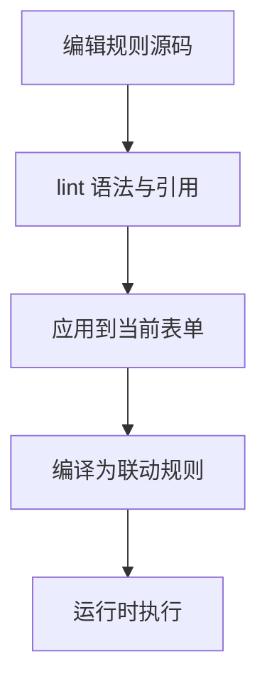

# 这页要解决什么

规则语法 Reference 不是任务教程，也不是截图导览。它回答四件事：

1. 这门 DSL 能写什么
2. 每种语句怎么写
3. 写完以后什么时候执行
4. 遇到错误时为什么会被拦住

Behavior Rule DSL 适合做轻量联动：显隐、必填、计算、选项刷新、按钮守卫、提交流程。它不是通用脚本语言，也不会执行任意 JavaScript。

> [!IMPORTANT]
> 这页强调的是语法、执行逻辑和用法边界，不再使用“步骤截图”假装解释 DSL。

## 这门 DSL 的边界

它适合做“围绕当前表单状态、可确定执行、单次触发就能完成”的规则，例如：

- 当前字段命中条件时显示或隐藏控件
- 某些字段变成必填或恢复为可选
- 用几个字段实时计算一个结果字段
- 根据上游字段刷新下游选项
- 在按钮点击或提交前做阻断校验

不适合写进 DSL 的逻辑包括：

- 长链路异步请求
- 多系统编排
- 复杂循环、聚合、批量加工
- 任意 JavaScript、浏览器 API 或自定义函数

一句话判断：如果这段逻辑需要“像写程序一样组织控制流”，那它大概率应该去流程或事件脚本，而不是 DSL。
