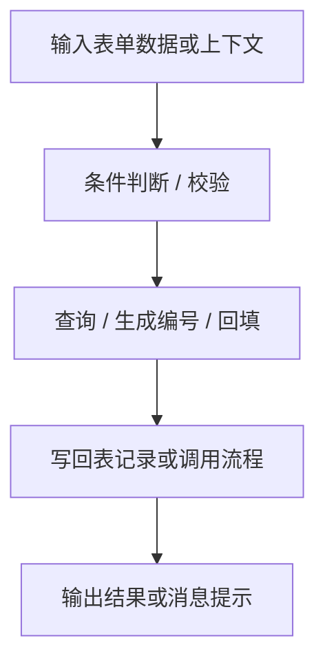

## 流程行为节点

流程行为节点组提供行为脚本执行、流程控制、数据操作和用户交互等功能。



## 行为脚本执行

> 在流程中执行自定义 JavaScript 脚本，可读写上下文数据

### 端口定义

**输入端口：**

| 端口名 | 类型 | 必填 | 说明 |
|--------|------|------|------|
| 上下文 | `object` | ❌ | 传入脚本的上下文数据 |

**输出端口：**

| 端口名 | 类型 | 说明 |
|--------|------|------|
| 结果 | `any` | 脚本返回值 |

### 参数配置

| 参数名 | 类型 | 默认值 | 说明 |
|--------|------|--------|------|
| 脚本代码 | `code` | - | JavaScript 脚本代码（必填） |

### 代码示例

```typescript editable
// 在脚本节点中处理数据
const script = nodes.jsScript({
  code: `
    const data = ctx.input || [];
    const filtered = data.filter(item => item.age > 18);
    return { adults: filtered, count: filtered.length };
  `,
  context: { input: [{ name: 'Alice', age: 25 }, { name: 'Bob', age: 15 }] },
});

console.log(script.outputs.result);
// { adults: [{ name: 'Alice', age: 25 }], count: 1 }
```

## 条件分支

> 根据条件表达式决定流程走向，支持多分支路由

### 端口定义

**输入端口：**

| 端口名 | 类型 | 必填 | 说明 |
|--------|------|------|------|
| 条件值 | `any` | ✅ | 用于判断的值 |

**输出端口：**

| 端口名 | 类型 | 说明 |
|--------|------|------|
| true | `any` | 条件为真时的输出 |
| false | `any` | 条件为假时的输出 |

### 参数配置

| 参数名 | 类型 | 默认值 | 说明 |
|--------|------|--------|------|
| 条件表达式 | `string` | - | JavaScript 条件表达式（必填） |

## 循环迭代

> 对数组或范围数据进行逐行迭代处理

### 端口定义

**输入端口：**

| 端口名 | 类型 | 必填 | 说明 |
|--------|------|------|------|
| 数据 | `json-rows` | ✅ | 要迭代的数组 |

**输出端口：**

| 端口名 | 类型 | 说明 |
|--------|------|------|
| 当前项 | `object` | 当前迭代的元素 |
| 当前索引 | `number` | 当前迭代的索引 |
| 结果 | `json-rows` | 迭代完成后的结果数组 |

## 查询列表

> 按条件查询项目数据表并直接回填列表字段

### 端口定义

**输入端口：**

| 端口名 | 类型 | 必填 | 说明 |
|--------|------|------|------|
| 查询条件 | `object` | ❌ | 筛选条件 |

**输出端口：**

| 端口名 | 类型 | 说明 |
|--------|------|------|
| 结果 | `json-rows` | 查询结果 |
| 总数 | `number` | 结果总数 |

### 参数配置

| 参数名 | 类型 | 默认值 | 说明 |
|--------|------|--------|------|
| 数据表 | `string` | - | 目标数据表 ID（必填） |
| 字段列表 | `string` | - | 要查询的字段，逗号分隔 |
| 排序字段 | `string` | - | 排序字段 |
| 每页数量 | `number` | 50 | 每页返回的记录数 |

## 生成下一个编号

> 扫描数据表指定列并生成下一条顺序编号

### 端口定义

**输出端口：**

| 端口名 | 类型 | 说明 |
|--------|------|------|
| 编号 | `string` | 生成的下一个编号 |

### 参数配置

| 参数名 | 类型 | 默认值 | 说明 |
|--------|------|--------|------|
| 数据表 | `string` | - | 目标数据表 ID（必填） |
| 编号字段 | `string` | - | 编号列名（必填） |
| 前缀 | `string` | - | 编号前缀 |
| 步长 | `number` | 1 | 递增步长 |

## 回填表单

> 把单条记录按映射批量回填到当前表单

### 端口定义

**输入端口：**

| 端口名 | 类型 | 必填 | 说明 |
|--------|------|------|------|
| 记录 | `object` | ✅ | 要回填的数据记录 |

### 参数配置

| 参数名 | 类型 | 默认值 | 说明 |
|--------|------|--------|------|
| 字段映射 | `string` | - | JSON 格式的字段映射（必填） |

## 写回表记录

> 按配置生成 upsert 写回动作，把记录保存到指定数据表

### 端口定义

**输入端口：**

| 端口名 | 类型 | 必填 | 说明 |
|--------|------|------|------|
| 记录 | `object` | ✅ | 要写回的记录 |

**输出端口：**

| 端口名 | 类型 | 说明 |
|--------|------|------|
| 结果 | `object` | 写回结果 |

### 参数配置

| 参数名 | 类型 | 默认值 | 说明 |
|--------|------|--------|------|
| 数据表 | `string` | - | 目标数据表 ID（必填） |
| 写入模式 | `enum` | upsert | insert / update / upsert |
| 匹配字段 | `string` | - | upsert 时的匹配字段 |

## 拼装消息

> 按模板生成提示文案，可展示给用户或写回表单字段

### 端口定义

**输入端口：**

| 端口名 | 类型 | 必填 | 说明 |
|--------|------|------|------|
| 数据 | `object` | ❌ | 模板变量数据 |

**输出端口：**

| 端口名 | 类型 | 说明 |
|--------|------|------|
| 消息 | `string` | 生成的消息文本 |

### 参数配置

| 参数名 | 类型 | 默认值 | 说明 |
|--------|------|--------|------|
| 消息模板 | `string` | - | 支持 {{variable}} 语法的模板（必填） |
| 输出目标 | `enum` | display | display / field |

## 必填校验

> 批量检查提交前的必填字段

### 端口定义

**输入端口：**

| 端口名 | 类型 | 必填 | 说明 |
|--------|------|------|------|
| 表单数据 | `object` | ❌ | 要校验的表单数据 |

**输出端口：**

| 端口名 | 类型 | 说明 |
|--------|------|------|
| 是否通过 | `boolean` | 校验是否全部通过 |
| 错误列表 | `array` | 未通过的字段列表 |

### 参数配置

| 参数名 | 类型 | 默认值 | 说明 |
|--------|------|--------|------|
| 必填字段 | `string` | - | 逗号分隔的必填字段名（必填） |

## 重置表单

> 按清空字段、默认值和保留字段统一重置表单

### 参数配置

| 参数名 | 类型 | 默认值 | 说明 |
|--------|------|--------|------|
| 清空字段 | `string` | - | 要清空的字段，逗号分隔 |
| 保留字段 | `string` | - | 不清空的字段，逗号分隔 |
| 使用默认值 | `boolean` | true | 是否恢复默认值 |

## 流程调用

> 调用其他已定义的流程，实现流程复用和模块化

### 端口定义

**输入端口：**

| 端口名 | 类型 | 必填 | 说明 |
|--------|------|------|------|
| 参数 | `object` | ❌ | 传入子流程的参数 |

**输出端口：**

| 端口名 | 类型 | 说明 |
|--------|------|------|
| 结果 | `object` | 子流程的输出结果 |

### 参数配置

| 参数名 | 类型 | 默认值 | 说明 |
|--------|------|--------|------|
| 目标流程 | `string` | - | 要调用的流程 ID（必填） |

## 延迟等待

> 在流程中插入延迟，用于异步操作或节流控制

### 参数配置

| 参数名 | 类型 | 默认值 | 说明 |
|--------|------|--------|------|
| 延迟时间 | `number` | 1000 | 延迟毫秒数（必填） |

### 注意事项

> [!WARNING]
> 延迟时间不宜过长，超过 30 秒可能导致流程超时。

> [!TIP]
> 流程调用节点支持递归调用，但需注意防止无限循环。
