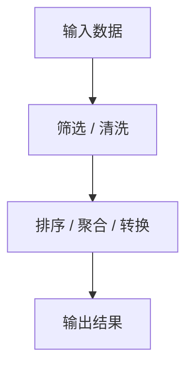
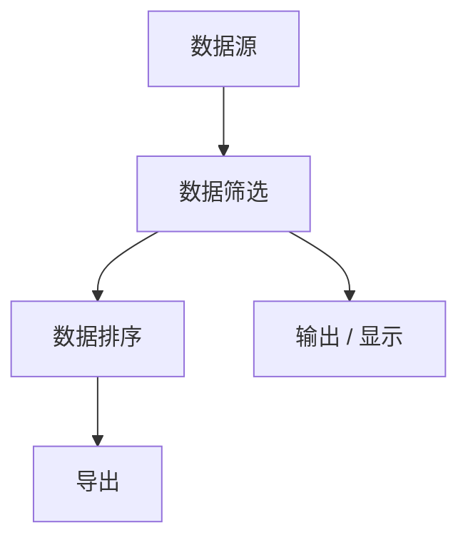

## 数据处理节点

数据处理节点组提供过滤、排序、聚合、清洗等数据操作，对 JSON 行或工作表数据进行转换和加工。



## 值输入

> 统一输入字符串、数字、布尔、数组或对象等基础值

### 端口定义

**输入端口：**

| 端口名 | 类型 | 必填 | 说明 |
|--------|------|------|------|
| 覆盖值 | `any` | ❌ | 运行时覆盖默认值 |

**输出端口：**

| 端口名 | 类型 | 说明 |
|--------|------|------|
| 值 | `any` | 当前值 |
| 变量名 | `string` | 变量名 |
| 值类型 | `string` | 当前值类型 |

### 参数配置

| 参数名 | 类型 | 默认值 | 说明 |
|--------|------|--------|------|
| 变量名 | `string` | - | 可选的变量标识 |
| 值类型 | `enum` | string | 输入值的类型 |
| 默认值 | `any` | - | 默认输入值 |
| 最小值 | `number` | -Infinity | 仅 number 生效 |
| 最大值 | `number` | Infinity | 仅 number 生效 |
| 步长 | `number` | 1 | 仅 number 生效 |
| 占位符 | `string` | 输入内容… | 仅 string 生效 |

### 代码示例

```typescript editable
// 创建一个数字输入节点
const numInput = nodes.valueInput({
  valueType: 'number',
  value: 42,
  min: 0,
  max: 100,
  step: 5,
});

console.log(numInput.outputs.value); // 42
console.log(numInput.outputs.valueType); // 'number'
```

## 选项输入

> 统一承接单选、多选与下拉类选项输入，支持静态或动态选项来源

### 端口定义

**输入端口：**

| 端口名 | 类型 | 必填 | 说明 |
|--------|------|------|------|
| 覆盖值 | `any` | ❌ | 运行时覆盖默认值 |
| 选项列表 | `array` | ❌ | 动态选项来源 |

**输出端口：**

| 端口名 | 类型 | 说明 |
|--------|------|------|
| 选中值 | `any` | 当前选中的值 |
| 选中项 | `object` | 选中的完整选项对象 |

### 参数配置

| 参数名 | 类型 | 默认值 | 说明 |
|--------|------|--------|------|
| 选择模式 | `enum` | single | 单选或多选 |
| 选项来源 | `enum` | static | 静态列表或动态数据 |
| 静态选项 | `string` | - | JSON 格式的选项数组 |

### 代码示例

```typescript editable
// 创建一个单选下拉
const select = nodes.optionInput({
  mode: 'single',
  source: 'static',
  options: JSON.stringify([
    { label: '北京', value: 'beijing' },
    { label: '上海', value: 'shanghai' },
    { label: '广州', value: 'guangzhou' },
  ]),
});

console.log(select.outputs.value); // 'beijing'
```

## 数据筛选

> 按字段、运算符和值筛选 JSON 行或工作表数据

### 端口定义

**输入端口：**

| 端口名 | 类型 | 必填 | 说明 |
|--------|------|------|------|
| 数据 | `json-rows` | ✅ | JSON 行数组 |
| 字段 | `string` | ❌ | 覆盖筛选字段 |
| 值 | `any` | ❌ | 覆盖筛选值 |

**输出端口：**

| 端口名 | 类型 | 说明 |
|--------|------|------|
| 结果 | `json-rows` | 筛选后的数据 |
| 匹配数 | `number` | 符合条件的记录数 |

### 参数配置

| 参数名 | 类型 | 默认值 | 说明 |
|--------|------|--------|------|
| 字段 | `string` | - | 字段名或列名（必填） |
| 运算符 | `enum` | == | 比较运算符 |
| 值 | `any` | - | 比较值（必填） |
| 忽略大小写 | `boolean` | true | 字符串比较时忽略大小写 |

### 代码示例

```typescript editable
// 筛选状态为 active 的记录
const result = nodes.filter({
  input: [
    { name: 'Alice', status: 'active' },
    { name: 'Bob', status: 'inactive' },
    { name: 'Charlie', status: 'active' },
  ],
  field: 'status',
  operator: '==',
  value: 'active',
});

console.log(result.outputs.result);
// [{ name: 'Alice', status: 'active' }, { name: 'Charlie', status: 'active' }]
console.log(result.outputs.count); // 2
```

### 连接模式



### 注意事项

> [!NOTE]
> 运算符支持：`==`、`!=`、`>`、`<`、`>=`、`<=`、`contains`、`startsWith`、`endsWith`、`regex`

> [!WARNING]
> 筛选大文件（>10 万行）时可能较慢，建议先投影需要的字段再筛选。

## 多条件筛选

> 按多组条件一次性筛选记录，适合候选过滤和规则化查询

### 端口定义

**输入端口：**

| 端口名 | 类型 | 必填 | 说明 |
|--------|------|------|------|
| 数据 | `json-rows` | ✅ | JSON 行数组 |
| 条件 | `filter` | ❌ | 筛选条件对象 |

**输出端口：**

| 端口名 | 类型 | 说明 |
|--------|------|------|
| 结果 | `json-rows` | 筛选后的数据 |
| 匹配数 | `number` | 符合条件的记录数 |

### 代码示例

```typescript editable
// 多条件筛选：年龄>25 且城市为北京
const result = nodes.multiFilter({
  input: [
    { name: 'Alice', age: 30, city: '北京' },
    { name: 'Bob', age: 22, city: '上海' },
    { name: 'Charlie', age: 28, city: '北京' },
  ],
  conditions: [
    { field: 'age', operator: '>', value: 25 },
    { field: 'city', operator: '==', value: '北京' },
  ],
  logic: 'and',
});

console.log(result.outputs.result);
// [{ name: 'Alice', age: 30, city: '北京' }, { name: 'Charlie', age: 28, city: '北京' }]
```

## 数据排序

> 按字段和顺序排列 JSON 行或工作表数据

### 端口定义

**输入端口：**

| 端口名 | 类型 | 必填 | 说明 |
|--------|------|------|------|
| 数据 | `json-rows` | ✅ | JSON 行数组 |

**输出端口：**

| 端口名 | 类型 | 说明 |
|--------|------|------|
| 结果 | `json-rows` | 排序后的数据 |

### 参数配置

| 参数名 | 类型 | 默认值 | 说明 |
|--------|------|--------|------|
| 排序字段 | `string` | - | 排序依据的字段名（必填） |
| 排序方向 | `enum` | asc | 升序或降序 |

### 代码示例

```typescript editable
// 按年龄降序排列
const result = nodes.sort({
  input: [
    { name: 'Alice', age: 30 },
    { name: 'Bob', age: 22 },
    { name: 'Charlie', age: 28 },
  ],
  field: 'age',
  order: 'desc',
});

console.log(result.outputs.result);
// [{ name: 'Alice', age: 30 }, { name: 'Charlie', age: 28 }, { name: 'Bob', age: 22 }]
```

## 记录变换

> 按字段映射、默认值和表达式把单条记录转成标准对象或 patch

### 端口定义

**输入端口：**

| 端口名 | 类型 | 必填 | 说明 |
|--------|------|------|------|
| 记录 | `object` | ✅ | 单条记录 |

**输出端口：**

| 端口名 | 类型 | 说明 |
|--------|------|------|
| 结果 | `object` | 变换后的记录 |

### 参数配置

| 参数名 | 类型 | 默认值 | 说明 |
|--------|------|--------|------|
| 字段映射 | `string` | - | JSON 格式的映射规则 |
| 默认值 | `string` | - | JSON 格式的默认值 |

### 代码示例

```typescript editable
// 字段重命名和默认值
const result = nodes.recordTransform({
  input: { name: 'Alice', age: 30 },
  mapping: JSON.stringify({ fullName: 'name', years: 'age' }),
  defaults: JSON.stringify({ role: 'user' }),
});

console.log(result.outputs.result);
// { fullName: 'Alice', years: 30, role: 'user' }
```

## 字段分类器

> 按枚举、区间和条件标签对字段分类，适合风险标签和技术画像生成

### 端口定义

**输入端口：**

| 端口名 | 类型 | 必填 | 说明 |
|--------|------|------|------|
| 数据 | `json-rows` | ✅ | JSON 行数组 |

**输出端口：**

| 端口名 | 类型 | 说明 |
|--------|------|------|
| 结果 | `json-rows` | 添加了标签列的数据 |
| 统计 | `object` | 各分类的计数 |

### 参数配置

| 参数名 | 类型 | 默认值 | 说明 |
|--------|------|--------|------|
| 分类字段 | `string` | - | 要分类的字段名（必填） |
| 标签字段 | `string` | category | 输出的标签字段名 |
| 分类规则 | `string` | - | JSON 格式的分类规则 |

## 数组查找

> 按主键或多条件从数组中查找单条或多条记录

### 端口定义

**输入端口：**

| 端口名 | 类型 | 必填 | 说明 |
|--------|------|------|------|
| 数据 | `json-rows` | ✅ | JSON 行数组 |
| 查找值 | `any` | ❌ | 覆盖查找值 |

**输出端口：**

| 端口名 | 类型 | 说明 |
|--------|------|------|
| 匹配项 | `object` | 第一条匹配记录 |
| 全部匹配 | `json-rows` | 所有匹配记录 |
| 匹配数 | `number` | 匹配记录数 |

### 参数配置

| 参数名 | 类型 | 默认值 | 说明 |
|--------|------|--------|------|
| 查找字段 | `string` | - | 主键字段名（必填） |
| 查找值 | `any` | - | 要查找的值（必填） |
| 返回模式 | `enum` | first | first 或 all |

## 数组增强

> 按关联键把参考数组字段补充到主数组，适合候选和附件合并

### 端口定义

**输入端口：**

| 端口名 | 类型 | 必填 | 说明 |
|--------|------|------|------|
| 主数据 | `json-rows` | ✅ | 主数据数组 |
| 参考数据 | `json-rows` | ✅ | 参考数据数组 |

**输出端口：**

| 端口名 | 类型 | 说明 |
|--------|------|------|
| 结果 | `json-rows` | 增强后的数据 |

### 参数配置

| 参数名 | 类型 | 默认值 | 说明 |
|--------|------|--------|------|
| 关联键 | `string` | - | 主数据中的关联字段（必填） |
| 参考键 | `string` | - | 参考数据中的关联字段（必填） |
| 补充字段 | `string` | - | 要补充的字段，逗号分隔 |

## 记录评分

> 按规则对记录数组打分并排序，适合推荐和优选场景

### 端口定义

**输入端口：**

| 端口名 | 类型 | 必填 | 说明 |
|--------|------|------|------|
| 数据 | `json-rows` | ✅ | JSON 行数组 |

**输出端口：**

| 端口名 | 类型 | 说明 |
|--------|------|------|
| 结果 | `json-rows` | 添加了分数列的数据（按分数降序） |

### 参数配置

| 参数名 | 类型 | 默认值 | 说明 |
|--------|------|--------|------|
| 评分规则 | `string` | - | JSON 格式的评分规则（必填） |
| 分数字段 | `string` | score | 输出的分数字段名 |

## 使用场景

> [!TIP]
> 数据处理节点可以串联使用，形成完整的数据处理流水线。

1. **数据筛选**：按条件过滤出符合要求的数据
2. **数据排序**：按指定字段对数据进行升序/降序排列
3. **数据转换**：将原始数据转换为目标格式
4. **数据聚合**：对数据进行分组统计和汇总
5. **数据清洗**：处理缺失值、重复值和异常值

### 典型流程

```
[文件来源] → [读取Excel] → [数据筛选] → [数据排序] → [记录变换] → [导出Excel]
                                                  ↓
                                            [记录评分] → [输出/显示]
```
