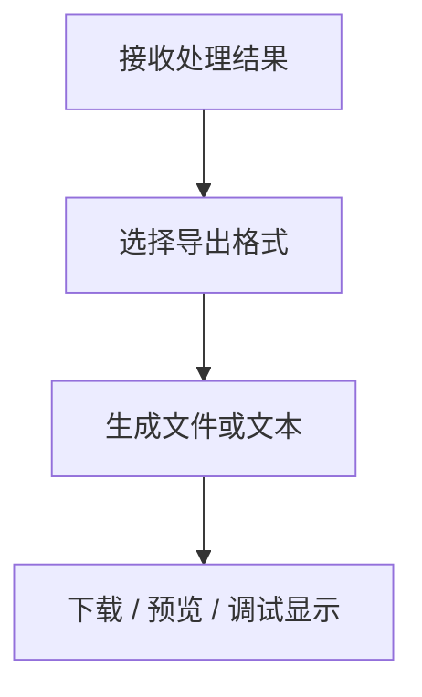
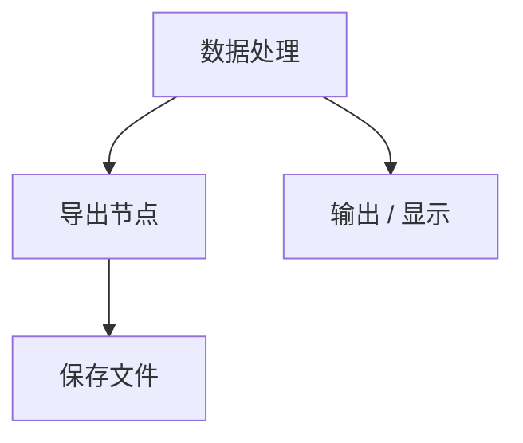

## 输出与集成节点

输出与集成节点组提供数据导出和结果展示功能。



## 数据导出

> 将 JSON 行、工作表或普通数据导出为 Excel、CSV、JSON 或 HTML 格式

### 端口定义

**输入端口：**

| 端口名 | 类型 | 必填 | 说明 |
|--------|------|------|------|
| 数据 | `any` | ✅ | JSON 行、工作表或普通数据 |
| 文件名 | `string` | ❌ | 覆盖文件名 |

**输出端口：**

| 端口名 | 类型 | 说明 |
|--------|------|------|
| 结果 | `any` | 文件数据或文本 |
| 文件名 | `string` | 完整文件名 |
| MIME 类型 | `string` | 内容类型 |

### 参数配置

| 参数名 | 类型 | 默认值 | 说明 |
|--------|------|--------|------|
| 格式 | `enum` | xlsx | xlsx / csv / json / html |
| 文件名 | `string` | export | 不含扩展名的文件名 |
| 工作表名 | `string` | Sheet1 | Excel 工作表名 |
| 包含表头 | `boolean` | true | 是否包含表头 |

### 代码示例

```typescript editable
// 导出为 CSV 格式
const result = nodes.export({
  data: [
    { name: 'Alice', age: 30 },
    { name: 'Bob', age: 25 },
  ],
  format: 'csv',
  fileName: 'users',
});

console.log(result.outputs.fileName); // 'users.csv'
console.log(result.outputs.mimeType); // 'text/csv'
```

## 输出/显示

> 接收输入值并显示，支持 auto、json、text 三种显示格式

### 端口定义

**输入端口：**

| 端口名 | 类型 | 必填 | 说明 |
|--------|------|------|------|
| 值 | `any` | ✅ | 要显示的值 |

### 参数配置

| 参数名 | 类型 | 默认值 | 说明 |
|--------|------|--------|------|
| 显示格式 | `enum` | auto | auto / json / text |

### 连接模式



### 注意事项

> [!TIP]
> 输出/显示节点常用于调试流程，可以在流程中间插入来查看中间结果。
